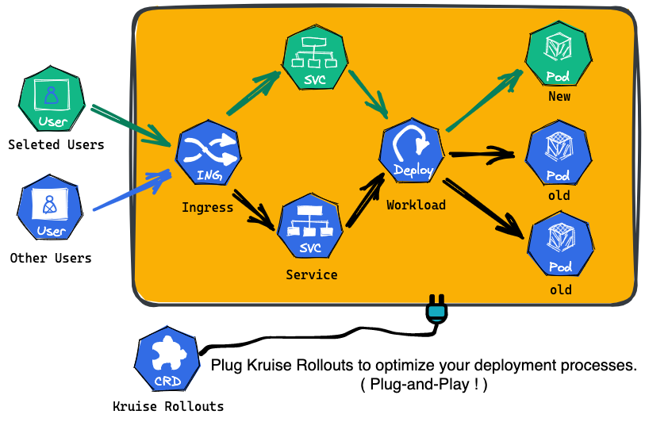

# Rollouts

## Introduction
Kruise Rollouts is a **Bypass** component that offers **Advanced Progressive Delivery Features**. Its support for canary, multi-batch, and A/B testing delivery modes can be helpful in achieving smooth and controlled rollouts of changes to your application, while its compatibility with Gateway API and various Ingress implementations makes it easier to integrate with your existing infrastructure. Overall, Kruise Rollouts is a valuable tool for Kubernetes users looking to optimize their deployment processes!

## Why Kruise Rollouts?
- **Functionality**：
  - Supports canary and multi-batch delivery for various workloads, such as Deployment, CloneSet, and StatefulSet.
  - Supports Fine-grained traffic orchestration of application with Kubernetes Ingress and [Gateway API](https://gateway-api.sigs.k8s.io/).

- **Flexibility**:
  - Handles both incremental and existing workloads with ease.
  - Be compatible with workload-referencing components like HPA, allowing for easy deployment and management of workloads.
  - Supports plug-and-play and hot-swapping, with immediate effect upon application, and the flexibility to be easily deleted at any stage, including during the rollout process.
  
- **Extensibility**:
  - Extend to other workloads and traffic types easily with pluggable lua scripts.

## Quick Start
- See [Getting Started](https://openkruise.io/rollouts/introduction/) documents in OpenKruise official website.

## Contributing
You are warmly welcome to hack on Kruise Rollout. We have prepared a detailed guide [CONTRIBUTING.md](CONTRIBUTING.md).

## Community
Active communication channels:

- Slack: [OpenKruise channel](https://kubernetes.slack.com/channels/openkruise) (*English*)
- DingTalk：Search GroupID `23330762` (*Chinese*)
- WeChat: Search User `openkruise` and let the robot invite you (*Chinese*)
- Bi-weekly Community Meeting (APAC, *Chinese*):
  - Thursday 19:00 GMT+8 (Asia/Shanghai), [Calendar](https://calendar.google.com/calendar/u/2?cid=MjdtbDZucXA2bjVpNTFyYTNpazV2dW8ybHNAZ3JvdXAuY2FsZW5kYXIuZ29vZ2xlLmNvbQ)
  - [Meeting Link(zoom)](https://us02web.zoom.us/j/87059136652?pwd=NlI4UThFWXVRZkxIU0dtR1NINncrQT09)
  - [Notes and agenda](https://shimo.im/docs/gXqmeQOYBehZ4vqo)
- Bi-weekly Community Meeting (*English*): TODO

## Acknowledge
- The global idea is from both OpenKruise and KubeVela communities, and the basic code of rollout is inherited from the KubeVela Rollout.
- This project is maintained by both contributors from [OpenKruise](https://openkruise.io/) and [KubeVela](https://kubevela.io).

## License
Kruise Rollout is licensed under the Apache License, Version 2.0. See [LICENSE](./LICENSE.md) for the full license text.

