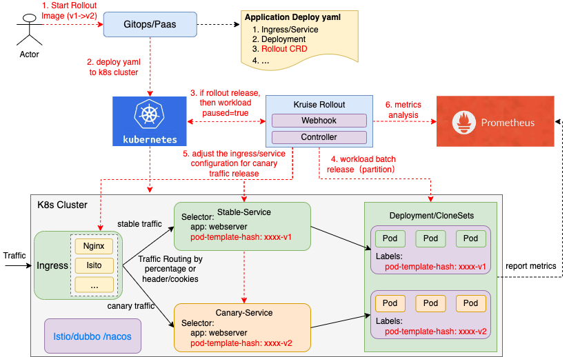

# Introduction
## What is Kruise Rollout?
Kruise Rollouts is **a Bypass component which provides advanced deployment capabilities such as canary, traffic routing, and progressive delivery features, for a series of Kubernetes workloads, such as Deployment and CloneSet**.

Kruise Rollout integrates with ingress controllers and service meshes, leveraging their traffic shaping abilities to gradually shift traffic to the new version during an update.
In addition, the business Pods metrics analysis can be used during rollout to determine whether the release will continue or be suspended.

## Why is Kruise Rollout?
The native Kubernetes Deployment Object supports the **RollingUpdate** strategy which provides a basic set of safety guarantees(maxUnavailable, maxSurge) during an update. However the rolling update strategy faces many limitations:
- **The process of batch release cannot be strictly controlled**, e.g. 20%, 40% etc. Although maxUnavailable, maxSurge can control the release rate, it will release the next batch as soon as the previous batch has been released.
- **Can't precisely control traffic flow during the release**, e.g. 20% traffic flow rate to the new version of Pods.
- **No ability to query external metrics to verify whether the business indicators during the upgrade process are normal**.

## Features
- **Functionality**：
  - Support multi-batch delivery for Deployment/CloneSet.
  - Support Nginx/ALB/Istio traffic routing control during rollout.

- **Flexibility**:
  - Support scaling up/down to workloads during rollout.
  - Can be applied to newly-created or existing workload objects directly;
  - Can be ridden out of at any time when you needn't it without consideration of unavailable workloads and traffic problems.
  - Can cooperate with other native/third-part Kubernetes controllers/operators, such as HPA and WorkloadSpread.

- **Non-Invasion**:
  - Does not invade native workload controllers.
  - Does not replace user-defined workload and traffic configurations.

- **Extensibility**:
  - Easily extend to other traffic routing types, or workload types via plugin codes.

- **Easy-integration**:
  - Easily integrate with classic or GitOps-style Kubernetes-based PaaS.

## What's Next
Here are some recommended next steps:
- Start to [Install Kruise Rollout](./installation.md).
- Learn Kruise Rollout's [Basic Usage](../tutorials/basic_usage.md).
- [Demo video](https://www.bilibili.com/video/BV1wT4y1Q7eD?spm_id_from=333.880.my_history.page.click)
