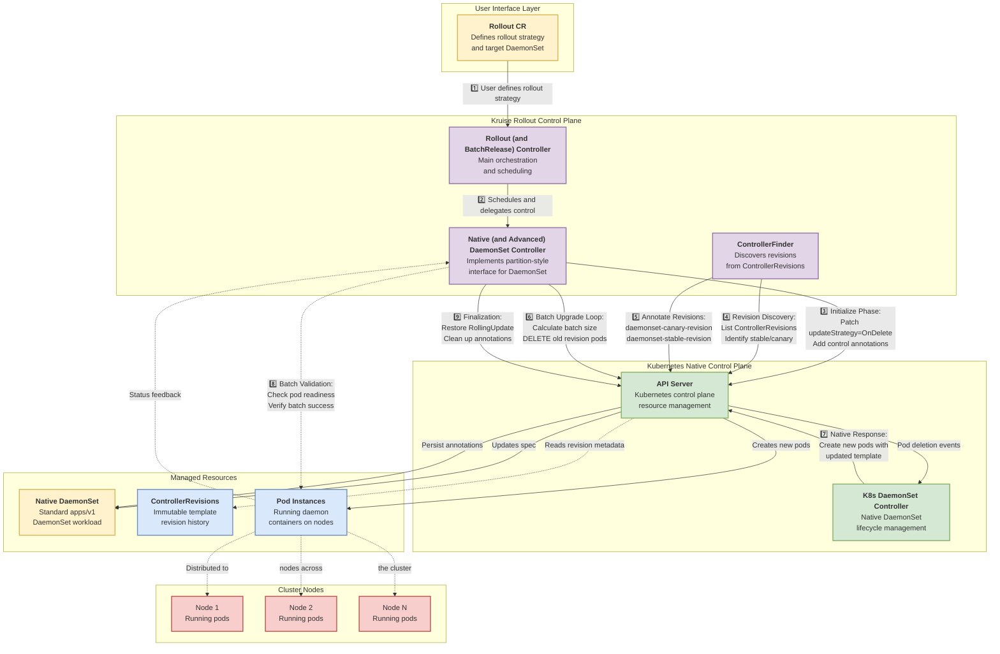

# Native DaemonSet Progressive Delivery

## Table of Contents

- [Native DaemonSet Progressive Delivery](#native-daemonset-progressive-delivery)
    - [Table of Contents](#table-of-contents)
    - [Glossary](#glossary)
    - [Summary](#summary)
    - [Motivation](#motivation)
        - [Goals](#goals)
        - [Non-Goals/Future Work](#non-goalsfuture-work)
    - [Proposal](#proposal)
        - [User Stories](#user-stories)
            - [Story 1](#story-1)
            - [Story 2](#story-2)
        - [Implementation Details](#implementation-details)
            - [Architecture Overview](#architecture-overview)
            - [ControllerRevision Discovery](#controllerrevision-discovery)
            - [BatchRelease and DaemonSet Interaction](#batchrelease-and-daemonset-interaction)
                - [Populating stableRevision and canaryRevision](#populating-stablerevision-and-canaryrevision)
                - [Calculating updatedReadyReplicas](#calculating-updatedreadyreplicas)
            - [Controller Implementation](#controller-implementation)
                - [Initialization Process](#initialization-process)
                - [Batch Upgrade Process](#batch-upgrade-process)
                - [Finalization Process](#finalization-process)
                - [Advanced DaemonSet Controller](#advanced-daemonset-controller)
            - [Rollback Support](#rollback-and-continuous-release-support)
        - [Risks and Mitigations](#risks-and-mitigations)
    - [Alternatives](#alternatives)
    - [Upgrade Strategy](#upgrade-strategy)
    - [Additional Details](#additional-details)
    - [Implementation History](#implementation-history)

## Glossary

- **Native DaemonSet**: A standard Kubernetes DaemonSet workload (apps/v1) without any extensions from OpenKruise.
- **Progressive Delivery**: A deployment strategy that gradually rolls out changes to a workload in a controlled manner.
- **Batch Release**: A progressive delivery pattern that releases changes in predefined batches or steps.
- **OnDelete Strategy**: A DaemonSet update strategy where pods are only updated when they are manually deleted.
- **RollingUpdate Strategy**: A DaemonSet update strategy where pods are automatically updated in a controlled manner.
- **ControllerRevision**: A Kubernetes resource that immutably stores the revision history of a workload's template, enabling rollbacks.


## Summary

This document proposes a mechanism to enable progressive delivery for native Kubernetes DaemonSet workloads within the Kruise Rollout framework. 
Since native DaemonSets lack support for partitioned rollouts, this design leverages the OnDelete update strategy to orchestrate controlled, multi-batch releases. 
This approach provides sophisticated rollout capabilities, including batched updates, rollback, and continuous release, without requiring traffic scheduling, which aligns with the typical use cases for daemon agents.

## Motivation

Native Kubernetes DaemonSets offer limited rollout control, forcing users to choose between a full `RollingUpdate` or a completely manual `OnDelete` process. 
This gap prevents operators from safely managing updates for critical node-level agents like monitoring collectors, logging daemons, and security tools. 
A failed rollout of such a component can have cluster-wide impact.

By integrating native DaemonSets with Kruise Rollouts, we provide a consistent, safe, and automated progressive delivery experience, extending the framework's benefits to a wider range of workloads without requiring users to adopt custom resource definitions like kruise.io/apps/v1alpha1/DaemonSet.


### Goals

- Enable multi-batch, canary-style releases for native Kubernetes DaemonSets with respects to maxUnavailable constraints
- Support automated rollback and continuous release capabilities
- Integrate seamlessly into the existing Kruise Rollout framework
- Maintain full compatibility with the standard apps/v1 DaemonSet API

### Non-Goals/Future Work

- Traffic routing support for DaemonSets (not needed for most use cases)
- Advanced deployment strategies beyond batched rollouts
- Support for third-party or non-standard DaemonSet implementations

## Proposal

### User Stories

#### Story 1

As a cluster operator, I want to roll out a new version of my logging agent DaemonSet to only 10% of my nodes at a time, so I can monitor for issues and minimize the risk of a cluster-wide logging outage.

#### Story 2

As a DevOps engineer, I want the ability to automatically or manually roll back a problematic DaemonSet update to its previous stable version to ensure service stability.

### Implementation Details

#### Architecture Overview

The implementation follows the existing Kruise Rollout architecture pattern with a dedicated controller for native DaemonSets:



#### ControllerRevision Discovery

A key part of the design is to identify the new (canary) and old (stable) versions of the DaemonSet. 
This is achieved by leveraging the native Kubernetes `ControllerRevision` resource.

1. **ControllerRevision Creation**: Kubernetes automatically creates a `ControllerRevision` object each time a workload's template is modified. For a DaemonSet, whenever `.spec.template` changes, the DaemonSet controller creates a new `ControllerRevision` containing the template's hash.

2. **Discovering Revisions**: The `ControllerFinder` is responsible for identifying the stable and canary revisions.
   * It fetches all `ControllerRevision` objects that are owned by the target DaemonSet.
   * These revisions are sorted in descending order based on their `revision` number, placing the newest revision first.
   * **Canary Revision**: The hash from the newest `ControllerRevision` (at index 0) is identified as the `canaryRevision`. This represents the desired new version.
   * **Stable Revision**: The hash from the second-newest `ControllerRevision` (at index 1) is identified as the `stableRevision`. This represents the previous, stable version. If only one revision exists, it is considered both stable and canary.

3. **Populating the `Workload` Struct**: The discovered revision information is then used to populate a generic `Workload` struct, which the rollout controller uses to make decisions. The `canaryRevision` and `stableRevision` fields of this struct are filled accordingly.

4. **Annotation Persistence**: The `ControllerFinder` writes these revision hashes into the DaemonSet's annotations:
   * `rollouts.kruise.io/daemonset-canary-revision`: For the canary revision hash.
   * `rollouts.kruise.io/daemonset-stable-revision`: For the stable revision hash.
   This step is crucial because it persists the revision information on the DaemonSet object itself, making it accessible to `BatchRelease` controllers.

#### BatchRelease and DaemonSet Interaction

When a `BatchRelease` resource targets a native Kubernetes `DaemonSet`, a specific control loop within the BatchRelease controller handles the interaction. 
This is necessary because native `DaemonSet`s do not inherently provide the same detailed status fields (like `stableRevision`, `canaryRevision`, or `updatedReadyReplicas` for a specific revision) as Kruise's advanced workloads.

##### Populating `stableRevision` and `canaryRevision`

1. **Annotation by ControllerFinder**: As described in the "Controller Finder" section, the `ControllerFinder` is responsible for inspecting the `ControllerRevision` objects associated with the `DaemonSet`. It identifies the latest revision as the `canary` and the second latest as the `stable`.

2. **Reading by BatchRelease Controller**: The `BatchRelease` controller does not directly use the in-memory `Workload` struct from the `ControllerFinder`. Instead, when it reconciles, its specialized controller for native `DaemonSet` reads the target DaemonSet.

3. **Parsing into WorkloadInfo**: The `nativedaemonset` controller calls the `util.ParseWorkload` function. This utility function reads the annotations from the `DaemonSet` object (`rollouts.kruise.io/daemonset-stable-revision`, etc.) and populates an internal `WorkloadInfo` struct with the `stableRevision` and `UpdateRevision`.

##### Calculating `updatedReadyReplicas`

Native `DaemonSet` status fields like `numberReady` or `updatedNumberScheduled` are aggregates and do not distinguish between pods of the stable and canary revisions. Therefore, the `BatchRelease` controller must calculate the number of ready canary pods itself.

1. **Pod Listing**: The `nativedaemonset` controller lists all pods that are owned by the target `DaemonSet`.

2. **Revision Matching and Status Check**: It then iterates through these pods and counts how many meet the following criteria:
   * The pod's `controller-revision-hash` label matches the `canaryRevision` (stored as `UpdateRevision` in its internal `WorkloadInfo` struct).
   * The pod is in a `Ready` condition.
   * The pod is not marked for deletion.

3. **Populating `updatedReadyReplicas`**: The resulting count is used to populate the `UpdatedReadyReplicas` field in the controller's internal `WorkloadInfo` status. This value is then used to determine if a batch has successfully rolled out and if it's safe to proceed to the next batch, by comparing it against the number of pods planned for the current batch.

In the controller's `BuildController` method, this calculation is performed as follows:

```go
// For native DaemonSet which has no updatedReadyReplicas field, we should
// list and count its owned Pods one by one.
if rc.WorkloadInfo != nil && rc.WorkloadInfo.Status.UpdatedReadyReplicas <= 0 {
    pods, err := rc.ListOwnedPods()
    if err != nil {
        return nil, err
    }
    updatedReadyReplicas := util.WrappedPodCount(pods, func(pod *corev1.Pod) bool {
        if !pod.DeletionTimestamp.IsZero() {
            return false
        }
        // Use rc.WorkloadInfo.Status.UpdateRevision for consistency
        if !util.IsConsistentWithRevision(pod.GetLabels(), rc.WorkloadInfo.Status.UpdateRevision) {
            return false
        }
        return util.IsPodReady(pod)
    })
    rc.WorkloadInfo.Status.UpdatedReadyReplicas = int32(updatedReadyReplicas)
}
```

This approach ensures that the controller has accurate information about how many pods of the canary revision are ready, which is essential for making decisions about when to proceed to the next batch in the rollout.

#### Controller Implementation

A new controller implementation is created in `pkg/controller/batchrelease/control/partitionstyle/nativedaemonset/` that implements the required interface methods:

1. `Initialize(release *v1beta1.BatchRelease) error` - Prepares the DaemonSet for batch release
2. `UpgradeBatch(ctx *batchcontext.BatchContext) error` - Executes batch upgrades
3. `Finalize(release *v1beta1.BatchRelease) error` - Cleans up after rollout completion
4. `CalculateBatchContext(release *v1beta1.BatchRelease) (*batchcontext.BatchContext, error)` - Calculates batch context

##### Initialization Process

During initialization, the controller:
1. Checks if the DaemonSet is already controlled by a BatchRelease
2. If not, patches the DaemonSet to:
   - Set the update strategy to `OnDelete` to enable manual control
   - Add the `BatchReleaseControlAnnotation` to mark it as controlled

##### Batch Upgrade Process

The batch upgrade process works through a delegation model where the native DaemonSet controller only manages annotations, while an advanced-daemonset-controller handles the actual pod deletion logic.

Native DaemonSet Controller Responsibilities:
1. Check Existing Annotations: Examines the DaemonSet for the presence of rollout control annotations
2. Annotation Management Logic:
    - If annotations are missing: Patches the DaemonSet with initial control annotations:
        - `rollouts.kruise.io/daemonset-partition: <ctx.Replicas - ctx.DesiredUpdatedReplicas>` - Specifies the number of pods to retain on the old version for this batch.
    - If annotations exist:
        - Checks if `rollouts.kruise.io/daemonset-partition` matches `ctx.DesiredUpdatedReplicas`
        - If it matches: Returns without action (batch is already in progress)
        - If it differs: Updates annotations with current values:
            - `rollouts.kruise.io/daemonset-partition: <ctx.Replicas - ctx.DesiredUpdatedReplicas>`

##### Finalization Process

Upon completion or cancellation of the rollout:
1. Removes the BatchRelease control annotations
2. Removes the revision annotations (`rollouts.kruise.io/daemonset-canary-revision`, `rollouts.kruise.io/daemonset-stable-revision`)
3. Removes the rollout control annotations (`rollouts.kruise.io/daemonset-partition`)
4. If the rollout is complete (BatchPartition == nil), restores the original update strategy to RollingUpdate
5. Cleans up any other Kruise Rollout specific annotations

##### Advanced DaemonSet Controller

The advanced-daemonset-controller is a separate controller that watches for native DaemonSets with the partition annotation and implements the actual pod deletion logic. 
It operates independently of the BatchRelease controller and responds to annotation changes.

Controller Responsibilities:

The advanced-daemonset-controller watches for native DaemonSets with the rollout batch annotation and implements the pod deletion logic:

1. Monitors DaemonSets for `rollouts.kruise.io/daemonset-partition` annotation changes when a new batch should be processed
2. Refreshing the pod list to get the current state of all DaemonSet-owned pods
3. Checking if any pods are currently being deleted (exits the reconciliation cycle if deletions are in progress to avoid race conditions)
4. Analyzing pods to determine which pods are running the old revision and need to be updated
5. Calculating how many pods need to be deleted based on the desired updated replicas value:
    - Current updated pods = count of pods with canary revision that are ready
    - Pods to delete = `desired-updated-replicas - Current updated pods`
6. Applying maxUnavailable constraints from the original DaemonSet spec to restrict the number of deletions
7. Deleting the required number of pods (oldest first based on creation timestamp)

#### Rollback and Continuous Release Support

Rollback is inherently supported by this design. 
When a rollback is triggered, the BatchRelease plan is updated to target the previous stable revision. 
The controller's logic remains the same: it identifies the desired revision (which is now the old stable revision) as the new "canary" and proceeds to delete pods running the newer, problematic revision in batches until the workload has reverted to its previous state.

Continuous release is also supported.
Once a rollout is started and not completed, the user can apply new updates to the DaemonSet.
The rollout controller will detect the new revision and adjust the rollout plan accordingly, allowing for ongoing updates to be rolled out in a controlled manner.

### Risks and Mitigations

**Risk**: Potential over-deletion of pods during batch upgrades

**Mitigation**: 
- Implement strict maxUnavailable constraints
- Track deleted pods within controller execution cycles
- Use proper loop breaking conditions

**Risk**: Performance issues with large clusters

**Mitigation**: 
- Efficient pod listing and filtering
- Proper caching of workload information
- Optimized reconciliation loops

## Alternatives

1. **Use OpenKruise DaemonSet**: Require users to migrate to OpenKruise DaemonSet which already has partition support. However, this would require changes to existing deployments and may not be feasible for all users.

2. **Custom Controller**: Develop a completely separate controller for native DaemonSet rollouts. This would duplicate much of the existing Kruise Rollout functionality and increase maintenance overhead.

3. **Manual Process**: Require users to manually manage DaemonSet rollouts. This doesn't provide the automated, controlled rollout capabilities that users need.

## Upgrade Strategy

This feature is additive and doesn't require changes to existing resources. Users can start using native DaemonSet progressive delivery by simply creating `Rollout` resources that reference native DaemonSets.

For existing clusters:
- No changes required for existing DaemonSets
- New functionality only activated when `Rollout` resources are created
- Backward compatibility maintained with all existing Kruise Rollout features

## Additional Details

The implementation will include comprehensive unit and integration tests to ensure reliability and correctness.

## Implementation History

- [ ] 09/16/2025: Initial proposal draft
- [ ] 09/23/2025: Finalized proposal and begin implementation
- [ ] 09/30/2025: Completed Native DaemonSet controller implementation
- [ ] 10/14/2025: Unit and integration tests completed
- [ ] 10/21/2025: Documentation and user guides updated
- [ ] 10/28/2025: Feature released in Kruise Rollout vx.y.z