# Leader Worker Set Rollout Support

## Table of Contents

- [Leader Worker Set Rollout Support](#leader-worker-set-rollout-support)
    - [Table of Contents](#table-of-contents)
    - [Glossary](#glossary)
    - [Summary](#summary)
    - [Motivation](#motivation)
        - [Goals](#goals)
        - [Non-Goals/Future Work](#non-goalsfuture-work)
    - [Proposal](#proposal)
        - [User Stories](#user-stories)
            - [Story 1](#story-1)
            - [Story 2](#story-2)
            - [Story 3](#story-3)
        - [Implementation Details](#implementation-details)
            - [Architecture Overview](#architecture-overview)
            - [Leader Worker Set Overview](#leader-worker-set-overview)
            - [Current State](#current-state)
            - [Rollout Controller Integration](#rollout-controller-integration)
            - [Canary Strategy Support](#canary-strategy-support)
            - [Blue-Green Strategy Support](#blue-green-strategy-support)
            - [Traffic Routing Support](#traffic-routing-support)
            - [Controller Implementation](#controller-implementation)
            - [Status Synchronization](#status-synchronization)
            - [Rollback Support](#rollback-support)
        - [Risks and Mitigations](#risks-and-mitigations)
    - [Alternatives](#alternatives)
    - [Upgrade Strategy](#upgrade-strategy)
    - [Additional Details](#additional-details)
    - [Implementation History](#implementation-history)

## Glossary

- **Leader Worker Set (LWS)**: A Kubernetes API for deploying groups of pods as a unit of replication, designed for AI/ML inference workloads where large language models are sharded across multiple devices and nodes.
- **Leader Pod**: The primary pod in a leader-worker group that coordinates the group's activities.
- **Worker Pod**: Supporting pods in a leader-worker group that perform distributed computation tasks.
- **Leader-Worker Group**: A unit consisting of one leader pod and M worker pods, managed together with the same lifecycle.
- **Rollout**: A Kruise Rollout resource that defines progressive delivery strategies for workloads.
- **Canary Release**: A deployment strategy that gradually rolls out changes in batches with traffic routing.
- **Blue-Green Release**: A deployment strategy that maintains two complete environments (blue/stable and green/canary) and switches traffic between them.
- **BatchRelease**: A lower-level resource created by Rollout to manage batch-by-batch releases.

## Summary

This document proposes comprehensive Rollout support for Leader Worker Set (LWS) workloads within the Kruise Rollout framework. Currently, the main branch has no LWS support. This proposal introduces complete Rollout functionality including workload discovery, canary and blue-green deployment strategies, traffic routing integration, and status synchronization. The implementation will provide safe, controlled progressive delivery for AI/ML inference workloads that require group-level pod management, enabling operators to use the same progressive delivery patterns for LWS workloads as they do for traditional Kubernetes workloads.

## Motivation

Leader Worker Set is increasingly used for deploying large-scale AI/ML inference workloads, particularly for multi-host inference scenarios where models are sharded across multiple nodes. These workloads have unique requirements:

1. **Group-level lifecycle management**: Pods in a leader-worker group must be created, updated, and deleted together as a unit.
2. **Coordinated updates**: Updates must respect group boundaries to maintain consistency during rollouts.
3. **Traffic management**: Leader pods often handle traffic routing to worker pods, requiring careful traffic management during updates.

Currently, the main branch has no LWS support. This proposal adds:
- Complete Rollout controller integration with workload discovery and status synchronization
- Canary deployment strategy support for LWS via Rollout
- Blue-green deployment strategy support for LWS
- Comprehensive traffic routing integration for LWS rollouts
- Unified experience with other workload types (Deployment, CloneSet, etc.) through Rollout

By providing complete Rollout support for LWS, we enable operators to use the same progressive delivery patterns and tooling for AI/ML workloads as they do for traditional applications, while respecting the unique group-based architecture of LWS.

### Goals

- Enable full Rollout controller support for Leader Worker Set workloads
- Support both canary and blue-green deployment strategies for LWS
- Integrate traffic routing capabilities for LWS rollouts
- Maintain group-level pod management semantics during rollouts
- Provide status synchronization between Rollout and BatchRelease for LWS
- Ensure backward compatibility with existing LWS canary controller implementation

### Non-Goals/Future Work

- Support for partition-style rolling updates (LWS uses group-based updates, not partition-based)
- Custom traffic routing providers specific to LWS (use existing traffic routing mechanisms)
- Leader-worker group topology awareness in rollout decisions (may be considered in future)
- Support for LWS-specific failure handling modes during rollouts

## Proposal

### User Stories

#### Story 1

As an ML engineer deploying a large language model inference service using Leader Worker Set, I want to perform a canary rollout with traffic routing, so I can gradually shift traffic to the new model version and monitor for issues before fully deploying.

#### Story 2

As a platform operator managing AI inference workloads, I want to use blue-green deployments for Leader Worker Set, so I can maintain zero-downtime updates with instant rollback capabilities for critical inference services.

#### Story 3

As a DevOps engineer, I want to see unified rollout status and history for Leader Worker Set workloads in the same way as other workloads, so I can use consistent tooling and monitoring across all application types.

### Implementation Details

#### Architecture Overview

The implementation builds upon the existing LWS canary controller and extends it to work seamlessly with the Rollout controller:

```mermaid
graph TB
    subgraph "User Interface Layer"
        RO["<b>Rollout CR</b><br/>Defines rollout strategy<br/>and target LeaderWorkerSet"]
    end

    subgraph "Kruise Rollout Control Plane"
        RC["<b>Rollout Controller</b><br/>Main orchestration<br/>Status synchronization"]
        BR["<b>BatchRelease Controller</b><br/>Batch-by-batch execution"]
        LWS_CTRL["<b>LWS Controller</b><br/>Canary & Blue-Green<br/>implementations"]
        TR["<b>TrafficRouting Manager</b><br/>Traffic routing<br/>coordination"]
    end

    subgraph "Kubernetes Native Layer"
        API["<b>API Server</b><br/>Kubernetes control plane"]
        LWS_CTRL_K8S["<b>LWS Controller</b><br/>Native LeaderWorkerSet<br/>lifecycle management"]
    end

    subgraph "Managed Resources"
        LWS_STABLE["<b>Stable LeaderWorkerSet</b><br/>Current production version"]
        LWS_CANARY["<b>Canary LeaderWorkerSet</b><br/>New version being tested"]
        PODS["<b>Pod Groups</b><br/>Leader-Worker groups"]
        SVC["<b>Services</b><br/>Traffic routing"]
    end

    RO -->|"1️⃣ User defines rollout"| RC
    RC -->|"2️⃣ Creates BatchRelease"| BR
    BR -->|"3️⃣ Delegates to LWS controller"| LWS_CTRL
    
    LWS_CTRL -->|"4️⃣ Canary: Create canary LWS<br/>Blue-Green: Manage both versions"| API
    API -->|"Manages lifecycle"| LWS_STABLE
    API -->|"Manages lifecycle"| LWS_CANARY
    
    LWS_CTRL -->|"5️⃣ Coordinate traffic"| TR
    TR -->|"6️⃣ Update service selectors<br/>Configure ingress/gateway"| SVC
    
    API -->|"7️⃣ Pod creation events"| LWS_CTRL_K8S
    LWS_CTRL_K8S -->|"8️⃣ Creates leader-worker groups"| PODS
    
    LWS_CTRL -.->|"9️⃣ Status feedback"| BR
    BR -.->|"🔟 Status sync"| RC

    classDef userLayer fill:#fff2cc,stroke:#d6b656,stroke-width:2px
    classDef controllerLayer fill:#e1d5e7,stroke:#9673a6,stroke-width:2px
    classDef k8sLayer fill:#d5e8d4,stroke:#82b366,stroke-width:2px
    classDef resourceLayer fill:#dae8fc,stroke:#6c8ebf,stroke-width:2px

    class RO,LWS_STABLE,LWS_CANARY userLayer
    class RC,BR,LWS_CTRL,TR controllerLayer
    class API,LWS_CTRL_K8S k8sLayer
    class PODS,SVC resourceLayer
```



#### Leader Worker Set Overview

Leader Worker Set (LWS) is a Kubernetes API designed for AI/ML inference workloads. Key characteristics:

- **Group-based replication**: Creates N replicas, where each replica is a leader-worker group
- **Dual templates**: Separate pod templates for leader and worker pods (or single template for both)
- **Group lifecycle**: All pods in a group share the same lifecycle and are created/deleted together
- **Rolling updates**: Groups are upgraded one-by-one as complete units
- **API Group**: `workload.kubernetes.io/v1alpha1`
- **Kind**: `LeaderWorkerSet`

LWS status fields include:
- `replicas`: Total number of leader-worker groups
- `readyReplicas`: Number of groups with all pods ready
- `updatedReplicas`: Number of groups updated to the new revision
- `updatedReadyReplicas`: Number of updated groups with all pods ready
- `stableRevision`: Hash of the stable template
- `updateRevision`: Hash of the update template

#### Current State

**Baseline (in main branch):**
The main branch currently has **no LWS support**. Leader Worker Set workloads are not supported by Kruise Rollout at this time.

**What This Proposal Adds:**
This proposal introduces complete Rollout support for LWS workloads, including:

1. **Workload Discovery**: Add LWS workload discovery and watching in Rollout controller
2. **Canary Strategy**: Complete canary rollout support with traffic routing integration
3. **Blue-Green Strategy**: Complete blue-green deployment support for LWS workloads
4. **Rollout Controller Integration**: Full status synchronization and event handling between Rollout and BatchRelease for LWS
5. **Traffic Routing**: Integration with existing traffic routing mechanisms (Ingress, Gateway API) for LWS leader pods
6. **BatchRelease Controllers**: Implementation of both canary-style and blue-green-style controllers for LWS in the BatchRelease framework
7. **Workload Utilities**: Add LWS to supported workload types and utilities

#### Rollout Controller Integration

This proposal adds complete LWS support to the Rollout controller:

1. **Workload Discovery**: Implement LWS workload discovery in `ControllerFinder` (`controller_finder.go`)
   - Add `getLeaderWorkerSet` method to discover and parse LWS workloads
   - Handle LWS-specific status fields and group-level semantics

2. **Workload Watching**: Register LWS as a watched workload type in `rollout_controller.go`
   ```go
   watchedWorkload.LoadOrStore(util.ControllerLWSKind.String(), struct{}{}) // LeaderWorkerSet
   ```

3. **Status Calculation**: Implement Rollout status calculation that correctly reflects LWS group-level metrics (groups vs individual pods)
   - Map LWS status fields to Rollout status
   - Handle group readiness (all pods in group must be ready)

4. **Event Handling**: Ensure Rollout responds appropriately to LWS changes and creates BatchRelease resources correctly
   - Handle LWS update events
   - Create BatchRelease with correct configuration for both canary and blue-green strategies

5. **Workload Utilities**: Add LWS support to workload utilities (`workloads_utils.go`)
   - Add `ControllerLWSKind` constant
   - Include LWS in supported workload types
   - Add LWS-specific parsing and status extraction utilities

#### Canary Strategy Support

This proposal implements complete canary strategy support for LWS workloads.

**Proposed Implementation:**
The canary controller will be implemented in `pkg/controller/batchrelease/control/canarystyle/lws/` with the following components:

1. **Canary LWS Management** (`canary.go`):
   - Canary LWS creation with proper labeling and annotations
   - Canary scaling based on batch progress (`UpgradeBatch`)
   - Canary deletion and cleanup (`Delete`)
   - Pod template metadata patching for traffic routing labels

2. **Stable LWS Management** (`stable.go`):
   - Stable LWS initialization and control annotation management
   - Finalization and promotion logic
   - Pause/unpause handling

3. **Controller Interface** (`control.go`):
   - Main controller implementation following the canary-style interface
   - Batch context calculation for LWS group-level metrics
   - Pod listing and filtering for status reporting

**Key Features:**
- Creates a canary LWS with `GenerateName` based on stable LWS name
- Sets owner reference to BatchRelease for proper cleanup
- Manages replicas to control rollout progress (group-by-group)
- Uses finalizers for cleanup
- Integrates with traffic routing for leader pod selection
- Verifies group readiness (all pods in group ready) before proceeding

#### Blue-Green Strategy Support

Blue-green strategy for LWS requires new implementation:

**Design:**
1. **Stable LWS Management**: Keep stable LWS running at full capacity
2. **Canary LWS Creation**: Create canary LWS with initial replicas (0 or small batch)
3. **Traffic Switching**: Use traffic routing to gradually shift traffic from stable to canary
4. **Promotion**: Once canary is validated, scale canary to full capacity and scale stable to 0
5. **Cleanup**: Delete stable LWS after successful promotion

**New Controller Implementation:**
Create `pkg/controller/batchrelease/control/bluegreenstyle/lws/` with:
- `control.go`: Main controller interface implementation
- `stable.go`: Stable LWS management
- `canary.go`: Canary LWS management (can reuse some logic from canary-style)

**Key Considerations:**
- LWS groups must be managed as units (cannot partially scale a group)
- Traffic routing should target leader pods (workers are accessed via leaders)
- Group readiness checks must verify all pods in a group

#### Traffic Routing Support

Traffic routing for LWS requires special consideration:

**Leader Pod Targeting:**
- Traffic should be routed to leader pods, not worker pods
- Service selectors must match leader pod labels
- Canary service should select canary leader pods

**Implementation:**
1. **Service Labeling**: Ensure leader pods have appropriate labels for service selection
2. **Canary Service Generation**: Generate canary service that selects canary leader pods
3. **Traffic Weight Management**: Use existing traffic routing mechanisms (Ingress, Gateway API, etc.)
4. **Header-based Routing**: Support A/B testing via header matching (routes to canary leader pods)

**Pod Template Metadata Patching:**
The canary controller will support `PatchPodTemplateMetadata` for traffic routing labels. Implementation will ensure:
- Labels are applied to leader pod template (not worker pods)
- Annotations for traffic routing are properly set
- Service selectors match the patched labels
- Canary service generation selects canary leader pods correctly

#### Controller Implementation

**Canary Style Controller** (new implementation):
- Location: `pkg/controller/batchrelease/control/canarystyle/lws/`
- Features:
  - Canary LWS creation and lifecycle management
  - Status reporting with group-level metrics
  - Error handling and recovery
  - Traffic routing label management
  - Group readiness verification

**Blue-Green Style Controller** (new implementation):
- Location: `pkg/controller/batchrelease/control/bluegreenstyle/lws/`
- Structure:
  ```go
  type realController struct {
      realStableController
      realCanaryController
  }
  ```
- Methods:
  - `Initialize`: Prepare stable and canary LWS
  - `UpgradeBatch`: Scale canary LWS for current batch
  - `Finalize`: Promote canary or rollback to stable
  - `CalculateBatchContext`: Calculate batch metrics

**BatchRelease Executor Integration:**
Add LWS support to `batchrelease_executor.go` to route both canary and blue-green LWS workloads:

For canary-style:
```go
case v1beta1.CanaryRollingStyle:
    if targetRef.APIVersion == util.ControllerLWSKind.GroupVersion().String() && 
       targetRef.Kind == util.ControllerLWSKind.Kind {
        return canarystyle.NewControlPlane(
            canarylws.NewController, 
            r.client, r.recorder, release, newStatus, targetKey
        ), nil
    }
```

For blue-green-style:
```go
case v1beta1.BlueGreenRollingStyle:
    if targetRef.APIVersion == util.ControllerLWSKind.GroupVersion().String() && 
       targetRef.Kind == util.ControllerLWSKind.Kind {
        return bluegreenstyle.NewControlPlane(
            bglws.NewController, 
            r.client, r.recorder, release, newStatus, targetKey, gvk
        ), nil
    }
```

#### Status Synchronization

Status synchronization between Rollout and BatchRelease for LWS:

**Workload Status Mapping:**
- `RolloutStatus.CanaryStatus.Replicas` ← LWS `status.replicas`
- `RolloutStatus.CanaryStatus.UpdatedReplicas` ← LWS `status.updatedReplicas`
- `RolloutStatus.CanaryStatus.UpdatedReadyReplicas` ← LWS `status.updatedReadyReplicas`
- `RolloutStatus.CanaryStatus.ReadyReplicas` ← LWS `status.readyReplicas`

**Group-Level Considerations:**
- Replicas represent groups, not individual pods
- Ready means all pods in the group are ready
- Updated means the group has been updated to the new revision

**Status Calculation:**
The `calculateRolloutStatus` function will be enhanced to properly handle LWS group-level semantics:
- Group readiness interpretation (all pods in group must be ready)
- Progress calculation based on groups (not individual pods)
- Error reporting for group-level failures
- Mapping between LWS status fields and Rollout status fields

#### Rollback Support

Rollback for LWS rollouts:

**Canary Rollback:**
- Scale canary LWS to 0 replicas
- Remove traffic routing to canary
- Stable LWS continues running

**Blue-Green Rollback:**
- Scale canary LWS to 0 replicas
- Restore traffic to stable LWS
- Optionally delete canary LWS

**Continuous Release:**
- Detect new template changes in stable LWS
- Create new canary LWS with updated template
- Proceed with rollout

### Risks and Mitigations

**Risk**: Group-level updates may be slower than pod-level updates, affecting rollout speed.

**Mitigation**:  
- Document expected rollout times for LWS workloads
- Provide configuration options for batch sizes
- Consider group readiness timeouts

**Risk**: Traffic routing to leader pods may not work correctly if leader pod selection fails.

**Mitigation**:
- Validate leader pod labels match service selectors
- Provide clear error messages for misconfiguration
- Add integration tests for traffic routing scenarios

**Risk**: Blue-green strategy requires maintaining two full LWS instances, doubling resource usage.

**Mitigation**:
- Document resource implications
- Provide guidance on when to use canary vs blue-green
- Consider resource-aware batch sizing

**Risk**: LWS API is still in alpha, may have breaking changes.

**Mitigation**:
- Pin to specific LWS API version
- Monitor LWS project for API changes
- Provide migration path if API changes

**Risk**: Group creation/deletion failures may leave rollout in inconsistent state.

**Mitigation**:
- Implement proper error handling and retry logic
- Use finalizers to ensure cleanup
- Provide manual intervention procedures

## Alternatives

1. **Use Native LWS Rolling Updates**: Rely on LWS's built-in rolling update mechanism. However, this doesn't provide the fine-grained control, traffic routing, and progressive delivery features that Rollout provides.

2. **Separate Controller for LWS**: Create a completely separate rollout controller for LWS. This would duplicate functionality and increase maintenance overhead.

3. **Manual Rollout Management**: Require users to manually manage LWS rollouts. This doesn't provide the automated, controlled rollout capabilities needed for production workloads.

4. **Use Deployment Instead**: Convert LWS workloads to Deployments. This loses the group-based semantics and coordinated lifecycle management that LWS provides.

## Upgrade Strategy

This is a new feature addition that doesn't require changes to existing resources. Users can start using Rollout for LWS by:

1. **Existing LWS Workloads**: After this feature is merged, create a Rollout resource that references an existing LWS workload
2. **New LWS Workloads**: Create both LWS and Rollout resources together

**For Existing Clusters:**
- No changes required for existing LWS workloads (they will continue to work with native LWS rolling updates)
- New Rollout functionality only activated when Rollout resources are created for LWS workloads
- Backward compatibility maintained with all existing Kruise Rollout features for other workload types
- This feature is opt-in - users must explicitly create Rollout resources to use progressive delivery for LWS

## Additional Details

### Testing Strategy

1. **Unit Tests**: Test controller logic for canary and blue-green strategies
2. **Integration Tests**: Test end-to-end rollouts with real LWS resources
3. **Traffic Routing Tests**: Verify traffic routing works correctly with leader pods
4. **Rollback Tests**: Test rollback scenarios for both strategies
5. **Failure Tests**: Test behavior when LWS groups fail to become ready

### Documentation

1. **User Guide**: Document how to use Rollout with LWS workloads
2. **Examples**: Provide example Rollout configurations for LWS
3. **Best Practices**: Guide on choosing between canary and blue-green for LWS
4. **Troubleshooting**: Common issues and solutions for LWS rollouts

### Performance Considerations

- LWS group creation/deletion may be slower than individual pod operations
- Status reconciliation should account for group-level operations
- Consider caching LWS status to reduce API server load

## Implementation History

- [ ] 2026-01-26: Initial proposal draft
- [ ] TBD: Proposal review and approval
- [ ] TBD: Add LWS workload discovery and utilities
- [ ] TBD: Canary controller implementation for LWS
- [ ] TBD: Blue-green controller implementation for LWS
- [ ] TBD: Rollout controller integration for LWS
- [ ] TBD: Traffic routing integration for LWS
- [ ] TBD: Status synchronization for LWS
- [ ] TBD: Unit and integration tests
- [ ] TBD: Documentation and user guides
- [ ] TBD: Feature released in Kruise Rollout vx.y.z
