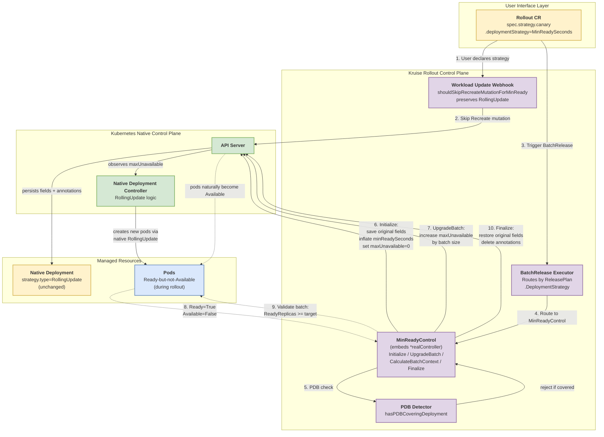

# Alternative Progressive Delivery for Deployment Using MinReadySeconds

## Table of Contents

- [Alternative Progressive Delivery for Deployment Using MinReadySeconds](#alternative-progressive-delivery-for-deployment-using-minreadyseconds)
    - [Table of Contents](#table-of-contents)
    - [Glossary](#glossary)
    - [Summary](#summary)
    - [Motivation](#motivation)
        - [Goals](#goals)
        - [Non-Goals/Future Work](#non-goalsfuture-work)
    - [Proposal](#proposal)
        - [User Stories](#user-stories)
            - [Story 1](#story-1)
            - [Story 2](#story-2)
        - [Implementation Details](#implementation-details)
            - [Architecture Overview](#architecture-overview)
            - [API Design](#api-design)
            - [Annotation Schema](#annotation-schema)
            - [Field Inflation Values](#field-inflation-values)
            - [Controller Implementation](#controller-implementation)
                - [Initialization Process](#initialization-process)
                - [Batch Upgrade Process](#batch-upgrade-process)
                - [Batch Context Calculation](#batch-context-calculation)
                - [Finalization Process](#finalization-process)
            - [Rollback Support](#rollback-support)
            - [Crash Recovery](#crash-recovery)
            - [Webhook Integration](#webhook-integration)
            - [Strategy Selection](#strategy-selection)
        - [Risks and Mitigations](#risks-and-mitigations)
    - [Alternatives](#alternatives)
    - [Upgrade Strategy](#upgrade-strategy)
    - [Additional Details](#additional-details)
    - [Implementation History](#implementation-history)

## Glossary

- **Native Deployment**: A standard Kubernetes Deployment workload (`apps/v1`) without OpenKruise extensions.
- **Progressive Delivery**: A deployment strategy that gradually rolls out changes to a workload in a controlled, multi-batch manner.
- **BatchRelease**: An OpenKruise primitive that releases changes in predefined batches or steps.
- **Partition-style Release**: A release pattern where a portion of pods retain the stable revision while the rest run the canary revision; opposed to canary-style (which creates an extra workload).
- **Recreate Strategy**: A Deployment update strategy where all old pods are terminated before new pods are created.
- **RollingUpdate Strategy**: A Deployment update strategy where pods are replaced gradually, governed by `maxUnavailable` and `maxSurge`.
- **`minReadySeconds`**: A Deployment field defining the minimum time a pod must be `Ready` before being considered `Available`. Inflated to a very large value in this proposal to gate pod availability.
- **`progressDeadlineSeconds`**: A Deployment field defining how long a rollout may stall before being marked `ProgressDeadlineExceeded`.
- **Ready-but-not-Available**: A pod state where `status.conditions[Ready]=True` but `status.conditions[Available]=False`, achieved by inflating `minReadySeconds`.
- **GitOps Drift**: An external write (typically by ArgoCD/Flux) that reverts a controller-managed field back to the desired state declared in Git.

## Summary

This document proposes an alternative mechanism for progressive delivery of native Kubernetes `Deployment` workloads within the Kruise Rollout framework that **never mutates `spec.strategy.type`**. The current implementation switches a Deployment's update strategy to `Recreate` during rollout, creating a dangerous failure window: if the Deployment is not properly paused during controller crashes, rollout removal, or partial failures, all pods may be recreated simultaneously, causing a service-wide outage ([#305](https://github.com/openkruise/rollouts/issues/305)).

The proposed approach keeps the Deployment's strategy as `RollingUpdate` throughout the rollout and leverages an inflated `minReadySeconds` value combined with progressive `maxUnavailable` adjustments to gate pod availability. Updated pods enter a `Ready-but-not-Available` state, giving the Rollout controller precise batch-level control. **The core safety guarantee is that, under any failure path, the Deployment's `spec.strategy.type` remains `RollingUpdate`**; in the worst case, pods remain `Ready-but-not-Available`, but never recreate en masse.

## Motivation

The current OpenKruise Rollout implementation for Deployment progressive delivery follows this flow:

1. A webhook mutator forces `spec.strategy.type = Recreate` in `pkg/webhook/workload/mutating/workload_update_handler.go`.
2. The partition-style controller patches the Deployment with `paused=true` plus `Recreate` strategy.
3. Finalization restores the original strategy after the rollout completes.

This design has a fundamental risk: **mutating `spec.strategy.type` is destructive and difficult to atomically reverse in failure scenarios**.

| Failure Scenario | Recreate Mode Outcome |
|---|---|
| Controller crashes mid-rollout | Deployment retains `Recreate` strategy; any subsequent trigger (HPA scale, manual edit, scale event) can recreate all pods. |
| Rollout disabled or deleted before strategy restoration | Upon unpause, the Deployment performs a full recreation. |
| Unexpected scale event during rollout | `Recreate` strategy produces unpredictable scaling behavior. |
| Partial finalization failure | Deployment is left in an inconsistent state. |

The fundamental insight is that **Kubernetes considers a pod `Available` only after it has been in the `Ready` condition for at least `minReadySeconds`**. By inflating `minReadySeconds` to a value that exceeds any realistic operational window (~68 years), newly created pods become `Ready-but-not-Available`, giving the Rollout controller delivery-pace control without ever modifying the destructive `strategy.type` field.

### Goals

- Enable multi-batch, canary-style progressive delivery for native Kubernetes Deployments **without mutating `spec.strategy.type`**.
- Preserve the safety guarantee that, under any failure path, the Deployment's strategy remains `RollingUpdate` and pods cannot be recreated en masse.
- Maintain full compatibility with Horizontal Pod Autoscaler (HPA) and other native Deployment-aware controllers.
- Support automated rollback through the native `RollingUpdate` controller after field restoration.
- Provide an opt-in mode controlled by a feature gate (`MinReadySecondsStrategy`), defaulting to off in the alpha phase.
- Maintain backward compatibility: existing `Rollout` resources without `deploymentStrategy` specified continue to use the current `Recreate`-based behavior.

### Non-Goals/Future Work

- **Replacing the existing `Recreate` mode**: This proposal introduces an opt-in alternative. The existing mode remains the default during the alpha phase.
- **Supporting workloads other than native Deployment**: CloneSet, StatefulSet, and DaemonSet are out of scope. Each has its own partition mechanism.
- **PodDisruptionBudget (PDB) coexistence in the alpha phase**: PDB selector matching is incompatible with long-lived `Ready-but-not-Available` pods (deadlock risk). Alpha rejects rollouts when a PDB covers the target Deployment. A future Plan B based on a custom `ReadinessGate` will lift this restriction.
- **Traffic routing for canary analysis**: Out of scope; orthogonal to this proposal and handled by the existing trafficrouting subsystem.
- **Self-healing of detected GitOps drift**: When external writes revert the inflated fields, the controller enters `Degraded` and requires human intervention. Automatic re-inflation would mask environment misconfiguration.

## Proposal

### User Stories

#### Story 1

As an SRE responsible for a financial service running on Kubernetes, I want to perform a canary release of my Deployment without changing its `strategy.type`, so that if the Rollout controller crashes or my GitOps tool reverts the rollout mid-flight, my pods cannot be simultaneously recreated and cause a full outage.

#### Story 2

As a platform engineer running workloads behind a Horizontal Pod Autoscaler, I want my Deployment to continue scaling normally during a progressive rollout. The existing `Recreate` mode breaks HPA compatibility during the rollout window; I need a strategy that preserves the native `RollingUpdate` semantics so HPA-driven replica changes remain valid.

### Implementation Details

#### Architecture Overview

The implementation follows the existing partition-style controller pattern. A new `MinReadyControl` struct embeds the existing `realController` and overrides the four interface methods that require MinReadySeconds-specific behavior; all other methods are reused without modification.



**Module dependencies**:

- `MinReadyControl` embeds `*realController` (the existing Recreate-mode controller); the inherited methods `GetWorkloadInfo`, `ListOwnedPods`, and `BuildController` are reused as-is. Only `Initialize`, `UpgradeBatch`, `CalculateBatchContext`, and `Finalize` are overridden.
- No new Go packages are introduced. All new source files live in existing directories (`pkg/controller/batchrelease/control/partitionstyle/deployment/` and `pkg/controller/batchrelease/control/partitionstyle/`), preserving the established architectural boundaries. The single exception is the metrics package (introduced only if observability is implemented as a follow-up).

#### API Design

The new strategy is opt-in via a new field on `CanaryStrategy`:

```yaml
apiVersion: rollouts.kruise.io/v1beta1
kind: Rollout
metadata:
  name: my-app-rollout
spec:
  workloadRef:
    apiVersion: apps/v1
    kind: Deployment
    name: my-app
  strategy:
    canary:
      deploymentStrategy: MinReadySeconds      # new field
      enableExtraWorkloadForCanary: false      # partition-style, default
      steps:
        - replicas: 20%
        - replicas: 50%
        - replicas: 100%
```

The field is defined in both `v1alpha1` and `v1beta1` Rollout types, with explicit conversion in `api/v1alpha1/conversion.go`. The same field is also added to `ReleasePlan` to allow the BatchRelease controller to read the strategy without re-fetching the Rollout.

```go
// api/v1beta1/rollout_types.go
type DeploymentStrategyType string

const (
    DeploymentStrategyRecreate        DeploymentStrategyType = "Recreate"
    DeploymentStrategyMinReadySeconds DeploymentStrategyType = "MinReadySeconds"
)
```

The default value is an empty string, treated equivalently to `Recreate` for backward compatibility. Validation uses `+kubebuilder:validation:Enum=Recreate;MinReadySeconds`.

#### Annotation Schema

During rollout, the original values of four Deployment fields are persisted in annotations on the Deployment object itself. This makes the rollout state recoverable across controller restarts without any in-memory state.

```
rollouts.kruise.io/original-min-ready-seconds:         "<int32 string>"
rollouts.kruise.io/original-progress-deadline-seconds: "<int32 string>"
rollouts.kruise.io/original-max-unavailable:           "<int or percent string>"
rollouts.kruise.io/original-max-surge:                 "<int or percent string>"
```

**Invariants**:

- All four annotations are written and deleted in a single `Patch` operation (relying on the Kubernetes API server's resource-level PATCH atomicity).
- All four present = rollout in progress; all four absent = idle state.
- If the user's original field is `nil` (relying on Kubernetes defaults), the sentinel value `__k8s_default__` is written. This preserves the distinction between "user explicitly set this value" and "user relied on the default", which is important during Finalize.

**Serialization rules**:

| Source type | Example value | Annotation string |
|---|---|---|
| `int32` (pointer non-nil) | `int32(10)` | `"10"` |
| `int32` (pointer nil) | — | `"__k8s_default__"` |
| `IntOrString` Type=Int | `{Type: Int, IntVal: 5}` | `"5"` |
| `IntOrString` Type=String | `{Type: String, StrVal: "25%"}` | `"25%"` |
| `*IntOrString` pointer nil | — | `"__k8s_default__"` |

#### Field Inflation Values

During `Initialize`, four Deployment fields are inflated:

| Field | Inflation value | Constant | Rationale |
|---|---|---|---|
| `minReadySeconds` | `2147483646` | `v1beta1.MaxReadySeconds` | Prevents pods from entering `Available` state within any realistic timeframe (~68 years). |
| `progressDeadlineSeconds` | `2147483647` | `v1beta1.MaxProgressSeconds` | Prevents the Deployment from reporting `ProgressDeadlineExceeded` during the inflated window. |
| `maxUnavailable` | `intstr.FromInt(0)` initially, then incremented per batch | — | Controls the rollout pace; the core mechanism for batched delivery. |
| `maxSurge` | `intstr.FromInt(1)` | — | Constrained to a low value to prevent runaway pod creation when `maxUnavailable=0` and the user's original `maxSurge` is high (e.g., 25%). |

**Why `minReadySeconds` is one less than `progressDeadlineSeconds`**: Kubernetes Deployment validation requires `minReadySeconds < progressDeadlineSeconds`. Setting both to `MaxInt32` would cause the Deployment to fail validation. The existing constant `MaxReadySeconds = MaxProgressSeconds - 1` (defined in `api/v1beta1/deployment_types.go`) is reused.

**Why `maxSurge` is saved and constrained**: When `maxUnavailable=0`, the native RollingUpdate controller may still create extra pods according to `maxSurge`. If the user's original `maxSurge` is `25%`, all 25% of new pods would be created at once and stuck in `Ready-but-not-Available`, wasting cluster resources and creating scheduling pressure. Constraining to `maxSurge=1` ensures that at most one new pod is created per cycle.

#### Controller Implementation

A new controller, `MinReadyControl`, is implemented in `pkg/controller/batchrelease/control/partitionstyle/deployment/minready_control.go`. It implements the existing `partitionstyle.Interface` by embedding the existing `realController`:

```go
type MinReadyControl struct {
    *realController
}

func NewMinReadyController(cli client.Client, key types.NamespacedName, gvk schema.GroupVersionKind) partitionstyle.Interface {
    return &MinReadyControl{realController: NewController(cli, key, gvk).(*realController)}
}
```

| Interface method | Behavior |
|---|---|
| `GetWorkloadInfo` | Inherited (no change). |
| `ListOwnedPods` | Inherited (no change). |
| `BuildController` | Inherited (no change). |
| `Initialize` | **Overridden** — see [Initialization Process](#initialization-process). |
| `UpgradeBatch` | **Overridden** — see [Batch Upgrade Process](#batch-upgrade-process). |
| `CalculateBatchContext` | **Overridden** — see [Batch Context Calculation](#batch-context-calculation). |
| `Finalize` | **Overridden** — see [Finalization Process](#finalization-process). |

##### Initialization Process

`Initialize` performs three steps in a single atomic `Patch`:

1. **Eligibility check** (`ensureInitializeAllowed`):
   - The `MinReadySecondsStrategy` feature gate must be enabled. Otherwise return error → `MinReadyDegraded`.
   - No PodDisruptionBudget may select the target Deployment. Otherwise return error → `MinReadyDegraded`. The check enumerates PDBs in the Deployment's namespace and matches against `spec.template.metadata.labels`.

2. **Annotation persistence** (`writeOriginalAnnotations`):
   - If any of the four annotations is already present, validate that all four exist (idempotency check) and that the on-disk fields are already inflated. If consistent, no-op.
   - Otherwise, serialize the current values of `minReadySeconds`, `progressDeadlineSeconds`, `maxUnavailable`, `maxSurge` per the serialization rules above and write all four annotations.

3. **Field inflation** (`inflateDeploymentStrategy`): Set the four fields to their inflation values.

4. **Atomic commit**: Issue a single `Patch` using `client.MergeFromWithOptions(original, client.MergeFromWithOptimisticLock{})`. The annotations and field changes are committed together; the Kubernetes API server's resource-level PATCH atomicity guarantees no partial state is observable.

##### Batch Upgrade Process

`UpgradeBatch(ctx)` is invoked per batch by the BatchRelease executor. It performs:

1. **Drift detection** (`ensureInflatedDeploymentStrategy`): Verify that `minReadySeconds == MaxReadySeconds`, `progressDeadlineSeconds == MaxProgressSeconds`, and `maxSurge == 1`. If any field has been externally modified, return error → `MinReadyDegraded`. The controller does not re-inflate; doing so could mask GitOps misconfiguration.

2. **Target computation**: Read the current `maxUnavailable` and compare against `ctx.DesiredUpdatedReplicas`.
   - If `current > target`: external write has increased `maxUnavailable` beyond the batch target → `MinReadyDegraded`.
   - If `current >= target`: already at target, no-op.

3. **Patch `maxUnavailable = target`**: A single-field Patch using the same optimistic-lock mechanism. The native RollingUpdate controller observes the change and creates new pods accordingly. Because `minReadySeconds` is inflated, the new pods enter `Ready-but-not-Available`.

##### Batch Context Calculation

`CalculateBatchContext(release)` computes the `DesiredUpdatedReplicas` for the current batch and assembles a `BatchContext` that downstream logic uses to determine batch readiness.

```go
replicas := int(*deployment.Spec.Replicas)  // read at reconcile time, HPA-compatible
desiredUpdatedReplicas, _ := intstr.GetScaledValueFromIntOrPercent(
    &release.Spec.ReleasePlan.Batches[currentBatch].CanaryReplicas,
    replicas,
    true,  // round up
)
```

**Critical design decision**: The returned `BatchContext.UpdatedReadyReplicas` field is populated with `object.Status.ReadyReplicas`, **not** `object.Status.UpdatedReadyReplicas`. This is because:

- In `MinReadySeconds` mode, new pods reach `Ready=True` but never `Available=True` until Finalize.
- Kubernetes' `Status.UpdatedReadyReplicas` requires pods to be `Available`, so this field remains zero throughout the rollout.
- The existing `BatchContext.IsBatchReady()` logic checks `UpdatedReadyReplicas >= DesiredUpdatedReplicas`. By populating it with `ReadyReplicas` instead, **pod readiness becomes the batch-ready signal**, which is the intended semantics for this strategy.

This semantic difference is documented and isolated to `MinReadyControl`; the existing CloneSet and Recreate-mode Deployment controllers retain their original `UpdatedReadyReplicas` semantics.

##### Finalization Process

`Finalize` restores the Deployment to its pre-rollout state. It performs:

1. If the Deployment object is `nil` (deleted), no-op.
2. If none of the four annotations is present, the Deployment is already in idle state — no-op.
3. **Parse annotations** (`parseOriginalDeploymentStrategy`):

| Annotation state | Parse result | Behavior |
|---|---|---|
| All four present and parseable | Restored field values (with `nil` indicating "user relied on default") | Normal Finalize. |
| Any one fails to parse (corrupt format) | Error | `MinReadyDegraded`. |
| Partial annotations missing | Error | `MinReadyDegraded`. |
| All four missing | — | No-op (already idle). |

4. **Field restoration** (`applyOriginalDeploymentStrategy`):
   - `minReadySeconds`: `nil` → set to `0` (Kubernetes default); non-nil → restore original.
   - `progressDeadlineSeconds`: `nil` → clear pointer (Kubernetes default `600`s applies); non-nil → restore original.
   - If both `maxUnavailable` and `maxSurge` are `nil`, clear the entire `RollingUpdate` block (Kubernetes default applies).
   - Otherwise, restore each field individually.

5. Delete all four annotations and `Patch` atomically.

**Why Degraded refuses to silently fall back to Kubernetes defaults**: A user whose original `maxUnavailable` was `50%` and whose annotations were corrupted should not be silently downgraded to the Kubernetes default `25%`. The release-rate change is operationally significant and should be surfaced for human review, not masked.

#### Rollback Support

Rollback in this strategy is naturally supported because the Deployment's `strategy.type` is never modified. Rollback is triggered by any of the following:

| Trigger | Detection | Behavior |
|---|---|---|
| User rolls back the image | Deployment `spec.template` hash changes | `Finalize` restores fields; the native RollingUpdate controller completes the rollback. |
| Rollout CR is deleted | `DeletionTimestamp` non-nil | `Finalize` runs from a finalizer before the Rollout is removed. |
| GitOps drift | External write detected during `ensureInflatedDeploymentStrategy` | `MinReadyDegraded`; the controller does not auto-repair. |
| PDB detected mid-rollout | PDB created after Initialize | `MinReadyDegraded`; user must remove the PDB or accept the alpha limitation. |

In all four cases, the Deployment remains in `RollingUpdate` mode throughout, so no failure path can lead to en-masse pod recreation.

#### Crash Recovery

The controller maintains **no in-memory state**. After a controller restart or leader election, the state is fully reconstructible from the Deployment's annotations and field values:

| Mid-state at restart | Detection | Recovery action |
|---|---|---|
| Before Initialize | No annotations | Re-run `Initialize` (idempotent). |
| After Initialize | Four annotations present + fields inflated | Skip `Initialize`, proceed to `UpgradeBatch`. |
| Mid-UpgradeBatch, `maxUnavailable` already at target | Annotations present, `maxUnavailable >= target` | Proceed to batch-ready check. |
| Mid-UpgradeBatch, `maxUnavailable` not yet at target | Annotations present, `maxUnavailable < target` | Re-issue the `UpgradeBatch` Patch. |
| Mid-Finalize, fields restored but annotations remain | Annotations present, fields not inflated | Re-issue the `Finalize` (deletes annotations). |
| After Finalize | No annotations | No-op. |

The state determination is always based on **observable Deployment state**, never on memory. This is a hard constraint on the implementation.

#### Webhook Integration

A single guard is added to `pkg/webhook/workload/mutating/workload_update_handler.go`:

```go
func shouldSkipRecreateMutationForMinReady(rollout *appsv1beta1.Rollout) bool {
    return rollout.Spec.Strategy.Canary != nil &&
        rollout.Spec.Strategy.Canary.DeploymentStrategy == appsv1beta1.DeploymentStrategyMinReadySeconds &&
        utilfeature.DefaultFeatureGate.Enabled(feature.MinReadySecondsStrategy)
}
```

The guard is invoked at the top of the existing Recreate mutation logic:

```go
if shouldSkipRecreateMutationForMinReady(rollout) {
    return false, nil  // do not mutate; preserve the user's original strategy
}
// ... existing Recreate mutation logic unchanged ...
```

When the feature gate is disabled or the strategy is unspecified/`Recreate`, the existing behavior is preserved exactly.

#### Strategy Selection

The BatchRelease executor routes to the appropriate controller based on `ReleasePlan.DeploymentStrategy`:

```go
if release.Spec.ReleasePlan.DeploymentStrategy == v1beta1.DeploymentStrategyMinReadySeconds {
    return partitionstyle.NewControlPlane(partitiondeployment.NewMinReadyController, ...)
}
return partitionstyle.NewControlPlane(partitiondeployment.NewController, ...)
```

An empty or unrecognized value falls through to the existing `NewController`, preserving the Recreate-mode default.

### Risks and Mitigations

**Risk**: PodDisruptionBudget incompatibility leading to deadlock.

PDB health evaluation requires pods to be `Available`. This strategy intentionally keeps pods `Ready-but-not-Available` for the rollout duration. A PDB covering the Deployment could refuse pod evictions, blocking the rollout indefinitely.

**Mitigation**:
- In the alpha phase, `Initialize` rejects rollouts when any PDB selector matches the target Deployment's pod template labels. The controller emits a `Warning` event and sets `MinReadyDegraded=True`.
- A future Plan B based on a custom `ReadinessGate` will allow PDB coexistence; tracked as Future Work.

---

**Risk**: GitOps tools (ArgoCD, Flux) revert inflated fields back to the values in Git.

If a GitOps controller observes `minReadySeconds=2147483646` and reverts it to the user's declared value, the rollout state becomes inconsistent.

**Mitigation**:
- `ensureInflatedDeploymentStrategy` detects drift on each `UpgradeBatch` and enters `Degraded` instead of silently re-inflating.
- Documentation will instruct GitOps users to add `rollouts.kruise.io/*` annotation paths and the inflated fields to their ignore-diff configuration during rollouts.

---

**Risk**: Annotation tampering causing field-restoration ambiguity during Finalize.

If a user or external system deletes or corrupts the original-value annotations, the controller cannot determine the user's intended pre-rollout state.

**Mitigation**:
- Finalize refuses to silently fall back to Kubernetes defaults. Missing or malformed annotations trigger `MinReadyDegraded` with a human-readable error message.
- Recovery requires manual intervention: the user must either restore the annotations from version control or manually reset the Deployment fields.

---

**Risk**: Pods stuck in `Ready-but-not-Available` if Finalize fails permanently.

The worst-case failure mode of this strategy.

**Mitigation**:
- **This is the intended worst case** and the core safety guarantee. Unlike Recreate mode, which can result in a service outage from en-masse pod recreation, this strategy degrades gracefully: pods continue serving traffic in their current state.
- A `MinReadyDegraded` condition is set, allowing observability systems to alert on the condition. The user can manually run `kubectl patch` to restore fields once the underlying issue is resolved.

## Alternatives

1. **Continue mutating `spec.strategy.type` to `Recreate`** (current implementation): Rejected because the destructive nature of strategy mutation cannot be atomically reversed under failure. Multiple production incidents ([#305](https://github.com/openkruise/rollouts/issues/305)) demonstrate the risk.

2. **Custom `ReadinessGate` to gate pod availability**: A future direction (Plan B) that would allow PDB coexistence. Rejected for the alpha phase because it requires a custom mutating webhook to inject the gate, a separate controller to manage the gate condition, and significant additional testing surface. Tracked as Future Work for beta.

3. **Use `paused=true` plus partition annotations** (similar to CloneSet): Rejected because the native Deployment controller does not honor a partition mechanism. Implementing partition-style for native Deployment would require either re-implementing the rolling update loop or relying on `Recreate`, returning to the original problem.

4. **Require users to migrate to OpenKruise CloneSet**: Rejected because CloneSet adoption requires deployment changes that may not be feasible for all users. This proposal explicitly aims to support `apps/v1.Deployment` users.

## Upgrade Strategy

This feature is **additive and opt-in**:

- A new feature gate `MinReadySecondsStrategy` is introduced with default value `false` (alpha).
- A new field `Canary.DeploymentStrategy` is added to the Rollout CRD with a default value of `""` (empty), which is treated as `Recreate` for backward compatibility.
- Existing Rollout resources without the new field continue to behave exactly as before.
- v1alpha1 → v1beta1 conversion is implemented in `api/v1alpha1/conversion.go` to copy the field bidirectionally.
- No migration is required for existing deployments.

Users opt in by setting `spec.strategy.canary.deploymentStrategy: MinReadySeconds` and enabling the feature gate on the kruise-rollout controller.

## Additional Details

- **Test plan**: Unit tests cover all four overridden methods with a focus on idempotency, GitOps drift detection, and the Finalize validation matrix. Integration tests using `envtest` exercise the full Initialize → UpgradeBatch → Finalize cycle. End-to-end tests on a real `kind` cluster cover five core scenarios: normal multi-batch rollout, mid-rollout rollback, controller restart recovery, HPA coexistence, and Rollout CR deletion mid-rollout.
- **Observability** (planned as a follow-up): four status conditions (`MinReadyInitialized` / `MinReadyBatching` / `MinReadyDegraded` / `MinReadyFinalized`), eight event reasons for normal and degraded transitions, and four Prometheus metrics (batch totals, batch duration histogram, stuck-time gauge, degraded counter). These are not required for the alpha phase but the contract and naming are reserved.
- **No new Go packages are introduced**. All new files live in existing package directories.

## Implementation History

- [ ] 05/23/2026: Initial proposal draft submitted
- [ ] Q2 2026 (GSoC bonding period): API field PR submitted and merged
- [ ] Q2 2026 (GSoC weeks 1–6): MinReadyControl core implementation (Initialize / UpgradeBatch / CalculateBatchContext / Finalize) with unit tests
- [ ] Q3 2026 (GSoC weeks 7–8): Webhook integration and strategy selection
- [ ] Q3 2026 (GSoC weeks 9–10): End-to-end tests covering the five core scenarios
- [ ] Q3 2026 (GSoC weeks 11–12): PDB hardening, edge cases, documentation
- [ ] TBD: Observability follow-up (status conditions, events, Prometheus metrics)
- [ ] TBD: Plan B (custom `ReadinessGate`) for PDB coexistence — beta phase
