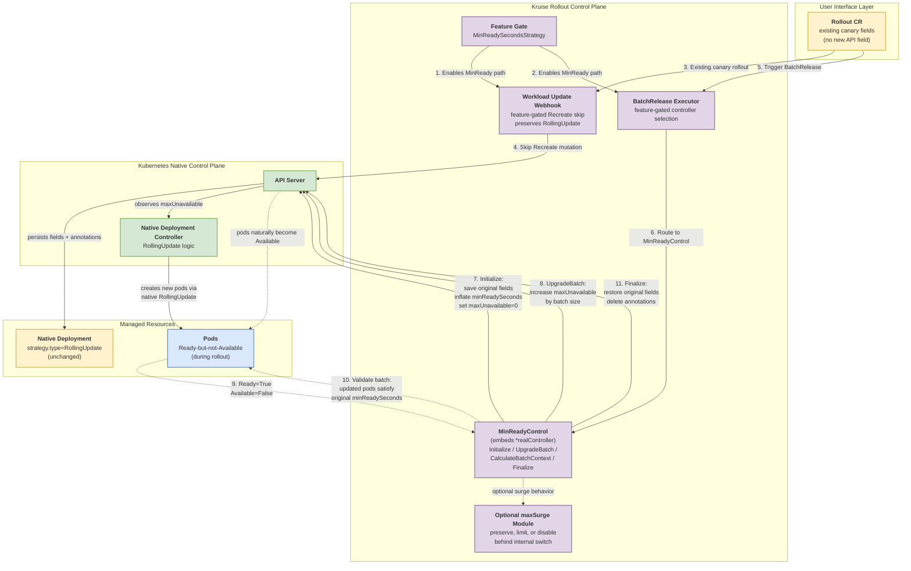

# Alternative Progressive Delivery for Deployment Using MinReadySeconds

## Table of Contents

- [Alternative Progressive Delivery for Deployment Using MinReadySeconds](#alternative-progressive-delivery-for-deployment-using-minreadyseconds)
    - [Table of Contents](#table-of-contents)
    - [Glossary](#glossary)
    - [Summary](#summary)
    - [Motivation](#motivation)
        - [Goals](#goals)
        - [Non-Goals/Future Work](#non-goalsfuture-work)
    - [Proposal](#proposal)
        - [User Stories](#user-stories)
            - [Story 1](#story-1)
            - [Story 2](#story-2)
        - [Implementation Details](#implementation-details)
            - [Architecture Overview](#architecture-overview)
            - [API Compatibility](#api-compatibility)
            - [Annotation Schema](#annotation-schema)
            - [Field Inflation Values](#field-inflation-values)
            - [Optional maxSurge Module](#optional-maxsurge-module)
            - [Controller Implementation](#controller-implementation)
                - [Initialization Process](#initialization-process)
                - [Batch Upgrade Process](#batch-upgrade-process)
                - [Batch Context Calculation](#batch-context-calculation)
                - [Finalization Process](#finalization-process)
            - [Rollback Support](#rollback-support)
            - [Crash Recovery](#crash-recovery)
            - [Webhook Integration](#webhook-integration)
            - [Strategy Selection](#strategy-selection)
        - [Risks and Mitigations](#risks-and-mitigations)
    - [Alternatives](#alternatives)
    - [Upgrade Strategy](#upgrade-strategy)
    - [Additional Details](#additional-details)
    - [Implementation History](#implementation-history)

## Glossary

- **Native Deployment**: A standard Kubernetes Deployment workload (`apps/v1`) without OpenKruise extensions.
- **Progressive Delivery**: A deployment strategy that gradually rolls out changes to a workload in a controlled, multi-batch manner.
- **BatchRelease**: An OpenKruise primitive that releases changes in predefined batches or steps.
- **Partition-style Release**: A release pattern where a portion of pods retain the stable revision while the rest run the canary revision; opposed to canary-style (which creates an extra workload).
- **Recreate Strategy**: A Deployment update strategy where all old pods are terminated before new pods are created.
- **RollingUpdate Strategy**: A Deployment update strategy where pods are replaced gradually, governed by `maxUnavailable` and `maxSurge`.
- **`minReadySeconds`**: A Deployment field defining the minimum time a pod must be `Ready` before being considered `Available`. Inflated to a very large value in this proposal to gate pod availability.
- **`progressDeadlineSeconds`**: A Deployment field defining how long a rollout may stall before being marked `ProgressDeadlineExceeded`.
- **Ready-but-not-Available**: A pod state where `status.conditions[Ready]=True` but `status.conditions[Available]=False`, achieved by inflating `minReadySeconds`.
- **GitOps Drift**: An external write (typically by ArgoCD/Flux) that reverts a controller-managed field back to the desired state declared in Git.
- **Original Availability**: Availability calculated by the Rollout controller with the user's original `minReadySeconds`, independent from the inflated Deployment field.

## Summary

This document proposes an alternative mechanism for progressive delivery of native Kubernetes `Deployment` workloads within the Kruise Rollout framework that **never mutates `spec.strategy.type`**. The current implementation switches a Deployment's update strategy to `Recreate` during rollout, creating a dangerous failure window: if the rollout controller or webhook becomes unavailable before the original strategy is restored, a later pod-template update can be handled by the native Deployment controller using `Recreate` semantics ([#305](https://github.com/openkruise/rollouts/issues/305)).

The proposed approach keeps the Deployment's strategy as `RollingUpdate` throughout the rollout and leverages an inflated `minReadySeconds` value combined with progressive `maxUnavailable` adjustments to gate pod availability. Updated pods enter a `Ready-but-not-Available` state, giving the Rollout controller precise batch-level control. **The core safety guarantee is that, under any failure path, the Deployment's `spec.strategy.type` remains `RollingUpdate`**; in the worst case, pods remain `Ready-but-not-Available`, but never recreate en masse.

## Motivation

The current OpenKruise Rollout implementation for Deployment progressive delivery follows this flow:

1. A webhook mutator forces `spec.strategy.type = Recreate` in `pkg/webhook/workload/mutating/workload_update_handler.go`.
2. The partition-style controller patches the Deployment with `paused=true` plus `Recreate` strategy.
3. Finalization restores the original strategy after the rollout completes.

This design has a fundamental risk: **mutating `spec.strategy.type` is destructive and difficult to atomically reverse in failure scenarios**.

| Failure Scenario | Recreate Mode Outcome |
|---|---|
| Controller or webhook is unavailable and an operator manually edits `spec.template` | Deployment still retains `Recreate`; the native Deployment controller can delete old pods before creating new pods for the template update. |
| Rollout disabled or deleted before strategy restoration, then the workload is unpaused or updated | The Deployment may continue the next native update using `Recreate` semantics. |
| Partial finalization failure | Deployment can be left with a destructive strategy until repaired. |

HPA replica changes and pure scale events are not the core failure mode by themselves. The dangerous case is a pod-template update while the Deployment has been left in `Recreate` because the rollout controller or webhook can no longer restore or guard the workload.

The fundamental insight is that **Kubernetes considers a pod `Available` only after it has been in the `Ready` condition for at least `minReadySeconds`**. By inflating `minReadySeconds` to a value that exceeds any realistic operational window (~68 years), newly created pods become `Ready-but-not-Available`, giving the Rollout controller delivery-pace control without ever modifying the destructive `strategy.type` field.

### Goals

- Enable multi-batch, canary-style progressive delivery for native Kubernetes Deployments **without mutating `spec.strategy.type`**.
- Preserve the safety guarantee that, under any failure path, the Deployment's strategy remains `RollingUpdate` and pods cannot be recreated en masse.
- Maintain full compatibility with Horizontal Pod Autoscaler (HPA) and other native Deployment-aware controllers.
- Support automated rollback through the native `RollingUpdate` controller after field restoration.
- Provide an opt-in mode controlled by a feature gate (`MinReadySecondsStrategy`), defaulting to off in the alpha phase.
- Maintain backward compatibility: when the feature gate is disabled, existing `Rollout` resources continue to use the current `Recreate`-based behavior.

### Non-Goals/Future Work

- **Replacing the existing `Recreate` mode**: This proposal introduces an opt-in alternative. The existing mode remains the default during the alpha phase.
- **Supporting workloads other than native Deployment**: CloneSet, StatefulSet, and DaemonSet are out of scope. Each has its own partition mechanism.
- **Using PDB as the batch-safety mechanism**: PDBs only protect eviction flows and cannot enforce this rollout's batch availability invariant. This strategy may coexist with a PDB, but the Rollout controller must compute batch readiness by itself.
- **Traffic routing for canary analysis**: Out of scope; orthogonal to this proposal and handled by the existing trafficrouting subsystem.
- **Changing the Rollout API**: This proposal does not add a new `deploymentStrategy` field or any other Rollout CRD field. Alpha selection is controlled only by the `MinReadySecondsStrategy` feature gate.

## Proposal

### User Stories

#### Story 1

As an SRE responsible for a financial service running on Kubernetes, I want to perform a canary release of my Deployment without changing its `strategy.type`, so that if the rollout controller or webhook is unavailable and someone updates the pod template, the native Deployment controller still observes `RollingUpdate` rather than `Recreate`.

#### Story 2

As a platform engineer running workloads behind a Horizontal Pod Autoscaler, I want my Deployment to continue scaling normally during a progressive rollout. I need a strategy that preserves the native `RollingUpdate` semantics so HPA-driven replica changes remain within standard Deployment behavior.

### Implementation Details

#### Architecture Overview

The implementation follows the existing partition-style controller pattern. A new `MinReadyControl` struct embeds the existing `realController` and overrides the four interface methods that require MinReadySeconds-specific behavior; all other methods are reused without modification.



**Module dependencies**:

- `MinReadyControl` embeds `*realController` (the existing Recreate-mode controller); the inherited methods `GetWorkloadInfo`, `ListOwnedPods`, and `BuildController` are reused as-is. Only `Initialize`, `UpgradeBatch`, `CalculateBatchContext`, and `Finalize` are overridden.
- No new Go packages are introduced. All new source files live in existing directories (`pkg/controller/batchrelease/control/partitionstyle/deployment/` and `pkg/controller/batchrelease/control/partitionstyle/`), preserving the established architectural boundaries. The single exception is the metrics package (introduced only if observability is implemented as a follow-up).

#### API Compatibility

The alpha implementation must not add a new field to the Rollout CRD. The MinReadySeconds path is selected only by the `MinReadySecondsStrategy` feature gate:

- Feature gate disabled: keep the existing Deployment rollout behavior, including the current Recreate mutation path.
- Feature gate enabled: Deployment partition-style rollout uses the MinReadySeconds controller path and the webhook preserves `spec.strategy.type=RollingUpdate`.

The user-facing Rollout shape remains unchanged:

```yaml
apiVersion: rollouts.kruise.io/v1beta1
kind: Rollout
metadata:
  name: my-app-rollout
spec:
  workloadRef:
    apiVersion: apps/v1
    kind: Deployment
    name: my-app
  strategy:
    canary:
      enableExtraWorkloadForCanary: false      # partition-style, default
      steps:
        - replicas: 20%
        - replicas: 50%
        - replicas: 100%
```

No `CanaryStrategy.DeploymentStrategy`, `ReleasePlan.DeploymentStrategy`, conversion logic, or CRD validation change is introduced. This keeps the proposal compatible with existing Rollout API versions and allows the alpha behavior to be enabled, disabled, or reverted by feature-gate configuration only.

#### Annotation Schema

During rollout, the original values of four Deployment fields are persisted in annotations on the Deployment object itself. This makes the rollout state recoverable across controller restarts without any in-memory state.

```
rollouts.kruise.io/original-min-ready-seconds:         "<int32 string>"
rollouts.kruise.io/original-progress-deadline-seconds: "<int32 string>"
rollouts.kruise.io/original-max-unavailable:           "<int or percent string>"
rollouts.kruise.io/original-max-surge:                 "<int or percent string>"
```

**Invariants**:

- All four annotations are written and deleted in a single `Patch` operation (relying on the Kubernetes API server's resource-level PATCH atomicity).
- All four present = rollout in progress; all four absent = idle state.
- If the user's original field is `nil` (relying on Kubernetes defaults), the sentinel value `__k8s_default__` is written. This preserves the distinction between "user explicitly set this value" and "user relied on the default", which is important during Finalize.

**Serialization rules**:

| Source type | Example value | Annotation string |
|---|---|---|
| `int32` (pointer non-nil) | `int32(10)` | `"10"` |
| `int32` (pointer nil) | — | `"__k8s_default__"` |
| `IntOrString` Type=Int | `{Type: Int, IntVal: 5}` | `"5"` |
| `IntOrString` Type=String | `{Type: String, StrVal: "25%"}` | `"25%"` |
| `*IntOrString` pointer nil | — | `"__k8s_default__"` |

#### Field Inflation Values

During `Initialize`, the core MinReadySeconds path inflates three Deployment fields:

| Field | Inflation value | Constant | Rationale |
|---|---|---|---|
| `minReadySeconds` | `2147483646` | `v1beta1.MaxReadySeconds` | Prevents pods from entering `Available` state within any realistic timeframe (~68 years). |
| `progressDeadlineSeconds` | `2147483647` | `v1beta1.MaxProgressSeconds` | Prevents the Deployment from reporting `ProgressDeadlineExceeded` during the inflated window. |
| `maxUnavailable` | `intstr.FromInt(0)` initially, then incremented per batch | — | Controls the rollout pace; the core mechanism for batched delivery. |

**Why `minReadySeconds` is one less than `progressDeadlineSeconds`**: Kubernetes Deployment validation requires `minReadySeconds < progressDeadlineSeconds`. Setting both to `MaxInt32` would cause the Deployment to fail validation. The existing constant `MaxReadySeconds = MaxProgressSeconds - 1` (defined in `api/v1beta1/deployment_types.go`) is reused.

`maxSurge` is deliberately not part of the core field-inflation contract. It is handled by a separate policy module so maintainers can enable full surge support, use a conservative alpha policy, or temporarily disable the module without changing the MinReadySeconds rollout algorithm.

#### Optional maxSurge Module

Native Deployment RollingUpdate supports surge capacity, and this proposal should not require `maxSurge=1` as a semantic constraint. The implementation isolates surge handling behind an internal policy boundary:

```go
type surgePolicy interface {
    Initialize(deployment *appsv1.Deployment, original intstr.IntOrString) error
    Ensure(deployment *appsv1.Deployment, original intstr.IntOrString) error
    Restore(deployment *appsv1.Deployment, original intstr.IntOrString) error
}
```

Supported policy choices:

| Policy | Alpha status | Behavior |
|---|---|---|
| `PreserveSurgePolicy` | Preferred if accepted | Preserve the user's original `maxSurge`. Surge-created updated pods are allowed, but they are counted as batch-complete only after satisfying the original `minReadySeconds`. |
| `ConservativeSurgePolicy` | Fallback | Save and restore the user's original `maxSurge`, but use a small live value during rollout to reduce temporary capacity pressure. This is an implementation fallback, not a user-visible API guarantee. |
| `DisabledSurgePolicy` | Escape hatch | Reject or degrade workloads whose `maxSurge` requires unsupported behavior. This keeps the maxSurge module removable from alpha without touching the core MinReadySeconds controller. |

The batch-ready calculation is the same under all policies: count updated pods only after they are `Ready` and have remained ready for the user's original `minReadySeconds`. Therefore, preserving a larger `maxSurge` can increase temporary pod count, but it cannot mark a batch successful early.

Any policy must also preserve Kubernetes RollingUpdate validation rules. In particular, the live strategy must not set both `maxUnavailable=0` and `maxSurge=0`. If the maxSurge module is disabled for alpha, the controller should reject unsupported surge configurations or keep a minimal valid live surge value rather than writing an invalid Deployment strategy.

#### Controller Implementation

A new controller, `MinReadyControl`, is implemented in `pkg/controller/batchrelease/control/partitionstyle/deployment/minready_control.go`. It implements the existing `partitionstyle.Interface` by embedding the existing `realController`:

```go
type MinReadyControl struct {
    *realController
}

func NewMinReadyController(cli client.Client, key types.NamespacedName, gvk schema.GroupVersionKind) partitionstyle.Interface {
    return &MinReadyControl{realController: NewController(cli, key, gvk).(*realController)}
}
```

| Interface method | Behavior |
|---|---|
| `GetWorkloadInfo` | Inherited (no change). |
| `ListOwnedPods` | Inherited (no change). |
| `BuildController` | Inherited (no change). |
| `Initialize` | **Overridden** — see [Initialization Process](#initialization-process). |
| `UpgradeBatch` | **Overridden** — see [Batch Upgrade Process](#batch-upgrade-process). |
| `CalculateBatchContext` | **Overridden** — see [Batch Context Calculation](#batch-context-calculation). |
| `Finalize` | **Overridden** — see [Finalization Process](#finalization-process). |

##### Initialization Process

`Initialize` performs three steps in a single atomic `Patch`:

1. **Eligibility check** (`ensureInitializeAllowed`):
   - The `MinReadySecondsStrategy` feature gate must be enabled. Otherwise return error → `MinReadyDegraded`.
   - The Deployment must use `RollingUpdate`. `Recreate` workloads continue to use the existing path.
   - PDB presence is not a hard rejection. PDBs are detected for observability only because they protect Eviction API flows, not Deployment rolling updates.

2. **Annotation persistence** (`writeOriginalAnnotations`):
   - If any of the four annotations is already present, validate that all four exist (idempotency check) and that the on-disk fields are already inflated. If consistent, no-op.
   - Otherwise, serialize the current values of `minReadySeconds`, `progressDeadlineSeconds`, `maxUnavailable`, `maxSurge` per the serialization rules above and write all four annotations.

3. **Field inflation** (`inflateDeploymentStrategy`): Set `minReadySeconds`, `progressDeadlineSeconds`, and `maxUnavailable` to their MinReadySeconds values. Apply the configured `maxSurge` policy module if enabled.

4. **Atomic commit**: Issue a single `Patch` using `client.MergeFromWithOptions(original, client.MergeFromWithOptimisticLock{})`. The annotations and field changes are committed together; the Kubernetes API server's resource-level PATCH atomicity guarantees no partial state is observable.

##### Batch Upgrade Process

`UpgradeBatch(ctx)` is invoked per batch by the BatchRelease executor. It performs:

1. **Inflation invariant** (`ensureInflatedDeploymentStrategy`): Verify and, if necessary, patch the Deployment so `minReadySeconds == MaxReadySeconds` and `progressDeadlineSeconds == MaxProgressSeconds` before each batch operation. The active `maxSurge` policy performs its own `Ensure` step. This makes the inflated fields a rollout-long invariant rather than a one-time initialization side effect.

2. **Target computation**: Read the current `maxUnavailable` and compare against `ctx.DesiredUpdatedReplicas`.
   - If `current > target`: external write has increased `maxUnavailable` beyond the batch target → `MinReadyDegraded`.
   - If `current >= target`: already at target, no-op.

3. **Patch `maxUnavailable = target`**: A single-field Patch using the same optimistic-lock mechanism. The native RollingUpdate controller observes the change and creates new pods accordingly. Because `minReadySeconds` is inflated, the new pods enter `Ready-but-not-Available` from the Deployment controller's perspective.

##### Batch Context Calculation

`CalculateBatchContext(release)` computes the `DesiredUpdatedReplicas` for the current batch and assembles a `BatchContext` that downstream logic uses to determine batch readiness.

```go
replicas := int(*deployment.Spec.Replicas)  // read at reconcile time, HPA-compatible
desiredUpdatedReplicas, _ := intstr.GetScaledValueFromIntOrPercent(
    &release.Spec.ReleasePlan.Batches[currentBatch].CanaryReplicas,
    replicas,
    true,  // round up
)
```

**Critical design decision**: `ReadyReplicas` is not strong enough to be the batch-ready signal. The MinReadySeconds controller must calculate `updatedAvailableReplicas` explicitly with the user's original `minReadySeconds`:

1. Resolve the updated ReplicaSet or updated pod-template hash.
2. List pods owned by the Deployment.
3. Count only pods matching the updated revision.
4. Exclude pods with `deletionTimestamp != nil`.
5. Require `status.conditions[Ready].status == True`.
6. Require `Ready.LastTransitionTime + originalMinReadySeconds <= now`.

The computed value is then assigned to `BatchContext.UpdatedReadyReplicas` because `BatchContext.IsBatchReady()` already compares `UpdatedReadyReplicas >= DesiredUpdatedReplicas`.

The controller must use the original `minReadySeconds` saved in the Deployment annotation, not the inflated live field. It also must not use `Deployment.Status.AvailableReplicas` or ReplicaSet `AvailableReplicas` during the rollout because those status fields are computed with the inflated `minReadySeconds` and therefore intentionally remain lower than the batch target.

##### Finalization Process

`Finalize` restores the Deployment to its pre-rollout state. It performs:

1. If the Deployment object is `nil` (deleted), no-op.
2. If none of the four annotations is present, the Deployment is already in idle state — no-op.
3. **Parse annotations** (`parseOriginalDeploymentStrategy`):

| Annotation state | Parse result | Behavior |
|---|---|---|
| All four present and parseable | Restored field values (with `nil` indicating "user relied on default") | Normal Finalize. |
| Any one fails to parse (corrupt format) | Error | `MinReadyDegraded`. |
| Partial annotations missing | Error | `MinReadyDegraded`. |
| All four missing | — | No-op (already idle). |

4. **Field restoration** (`applyOriginalDeploymentStrategy`):
   - `minReadySeconds`: `nil` → set to `0` (Kubernetes default); non-nil → restore original.
   - `progressDeadlineSeconds`: `nil` → clear pointer (Kubernetes default `600`s applies); non-nil → restore original.
   - If both `maxUnavailable` and `maxSurge` are `nil`, clear the entire `RollingUpdate` block (Kubernetes default applies).
   - Otherwise, restore each field individually.

5. Delete all four annotations and `Patch` atomically.

**Why Degraded refuses to silently fall back to Kubernetes defaults**: A user whose original `maxUnavailable` was `50%` and whose annotations were corrupted should not be silently downgraded to the Kubernetes default `25%`. The release-rate change is operationally significant and should be surfaced for human review, not masked.

#### Rollback Support

Rollback in this strategy is naturally supported because the Deployment's `strategy.type` is never modified. Rollback is triggered by any of the following:

| Trigger | Detection | Behavior |
|---|---|---|
| User rolls back the image | Deployment `spec.template` hash changes | `Finalize` restores fields; the native RollingUpdate controller completes the rollback. |
| Rollout CR is deleted | `DeletionTimestamp` non-nil | `Finalize` runs from a finalizer before the Rollout is removed. |
| GitOps drift | External write lowers inflated fields during an active rollout | Reconcile and webhook restore the inflated values. |
| PDB exists or is created mid-rollout | PDB selector covers rollout pods | No hard failure; PDB continues to protect Eviction API flows, but batch readiness is controlled by the Rollout controller. |

In all four cases, the Deployment remains in `RollingUpdate` mode throughout, so no failure path can lead to en-masse pod recreation.

#### Crash Recovery

The controller maintains **no in-memory state**. After a controller restart or leader election, the state is fully reconstructible from the Deployment's annotations and field values:

| Mid-state at restart | Detection | Recovery action |
|---|---|---|
| Before Initialize | No annotations | Re-run `Initialize` (idempotent). |
| After Initialize | Four annotations present + fields inflated | Skip `Initialize`, proceed to `UpgradeBatch`. |
| Mid-UpgradeBatch, `maxUnavailable` already at target | Annotations present, `maxUnavailable >= target` | Proceed to batch-ready check. |
| Mid-UpgradeBatch, `maxUnavailable` not yet at target | Annotations present, `maxUnavailable < target` | Re-issue the `UpgradeBatch` Patch. |
| Mid-Finalize, fields restored but annotations remain | Annotations present, fields not inflated | Re-issue the `Finalize` (deletes annotations). |
| After Finalize | No annotations | No-op. |

The state determination is always based on **observable Deployment state**, never on memory. This is a hard constraint on the implementation.

#### Webhook Integration

A feature-gated guard is added to `pkg/webhook/workload/mutating/workload_update_handler.go`:

```go
func shouldSkipRecreateMutationForMinReady(rollout *appsv1beta1.Rollout) bool {
    return rollout.Spec.Strategy.Canary != nil &&
        !rollout.Spec.Strategy.Canary.EnableExtraWorkloadForCanary &&
        utilfeature.DefaultFeatureGate.Enabled(feature.MinReadySecondsStrategy)
}
```

The guard is invoked at the top of the existing Recreate mutation logic:

```go
if shouldSkipRecreateMutationForMinReady(rollout) {
    return false, nil  // do not mutate; preserve the user's original strategy
}
// ... existing Recreate mutation logic unchanged ...
```

When the feature gate is disabled, the existing behavior is preserved exactly.

The webhook also enforces the inflation invariant for active MinReadySeconds rollouts. If an external writer lowers or clears `minReadySeconds` or `progressDeadlineSeconds` while the Deployment still carries the original-value annotations, the webhook rewrites the update back to `MaxReadySeconds` and `MaxProgressSeconds`. This complements the reconcile-time `ensureInflatedDeploymentStrategy` check and prevents a short window where the native Deployment controller could observe restored values before the rollout has finalized.

#### Strategy Selection

The BatchRelease executor routes to the MinReadySeconds controller based on the feature gate and the existing rollout shape:

```go
if utilfeature.DefaultFeatureGate.Enabled(feature.MinReadySecondsStrategy) &&
    isNativeDeployment(release) &&
    isPartitionStyleCanary(release) {
    return partitionstyle.NewControlPlane(partitiondeployment.NewMinReadyController, ...)
}
return partitionstyle.NewControlPlane(partitiondeployment.NewController, ...)
```

No strategy value is copied through `ReleasePlan`; disabled feature gates and unsupported workload shapes fall through to the existing `NewController`, preserving the current Recreate-mode behavior.

### Risks and Mitigations

**Risk**: PDB semantics are weaker than rollout batch safety.

PDB is not incompatible with this proposal, but it solves a different problem. Kubernetes documents that PDBs are respected by clients using the [Eviction API](https://kubernetes.io/docs/concepts/workloads/pods/disruptions/#pod-disruption-budgets), and that pods deleted or unavailable due to a rolling upgrade count against the budget; however, workload resources such as Deployment and StatefulSet are not limited by PDBs when doing rolling upgrades. The [PDB API](https://kubernetes.io/docs/reference/kubernetes-api/policy-resources/pod-disruption-budget-v1/) and [disruption controller](https://github.com/kubernetes/kubernetes/blob/master/pkg/controller/disruption/disruption.go) count healthy pods with Pod `Ready=True`, not with Deployment `AvailableReplicas` or the workload's `minReadySeconds`.

Therefore, a PDB may coexist with this rollout, but it cannot enforce the MinReadySeconds batch invariant. It may report reduced `disruptionsAllowed` while pods are being updated, and it may block unrelated node-drain evictions during the rollout, but the Deployment rolling update still follows Deployment strategy fields.

**Mitigation**:
- Do not reject a Deployment rollout only because a PDB selector covers its pods.
- Emit an informational event when a matching PDB exists so operators understand that eviction budget and rollout batch readiness are separate controls.
- Calculate batch readiness inside `MinReadyControl` using updated revision plus original `minReadySeconds`; never rely on PDB status as the rollout readiness signal.

---

**Risk**: GitOps tools (ArgoCD, Flux) revert inflated fields back to the values in Git.

If a GitOps controller observes `minReadySeconds=2147483646` and reverts it to the user's declared value, the rollout state becomes inconsistent.

**Mitigation**:
- `ensureInflatedDeploymentStrategy` runs on every active reconcile and patches `minReadySeconds` and `progressDeadlineSeconds` back to the inflated values.
- The workload mutating webhook rewrites active updates that lower or clear the inflated fields before they reach storage.
- Documentation will instruct GitOps users to add `rollouts.kruise.io/*` annotation paths and the inflated fields to their ignore-diff configuration during rollouts. Reconciliation still repairs drift because the inflated values are part of the rollout contract.

---

**Risk**: Annotation tampering causing field-restoration ambiguity during Finalize.

If a user or external system deletes or corrupts the original-value annotations, the controller cannot determine the user's intended pre-rollout state.

**Mitigation**:
- Finalize refuses to silently fall back to Kubernetes defaults. Missing or malformed annotations trigger `MinReadyDegraded` with a human-readable error message.
- Recovery requires manual intervention: the user must either restore the annotations from version control or manually reset the Deployment fields.

---

**Risk**: Pods stuck in `Ready-but-not-Available` if Finalize fails permanently.

The worst-case failure mode of this strategy.

**Mitigation**:
- **This is the intended worst case** and the core safety guarantee. Unlike Recreate mode, which can result in a service outage from en-masse pod recreation, this strategy degrades gracefully: pods continue serving traffic in their current state.
- A `MinReadyDegraded` condition is set, allowing observability systems to alert on the condition. The user can manually run `kubectl patch` to restore fields once the underlying issue is resolved.

## Alternatives

1. **Continue mutating `spec.strategy.type` to `Recreate`** (current implementation): Rejected because the destructive nature of strategy mutation cannot be atomically reversed under failure. Multiple production incidents ([#305](https://github.com/openkruise/rollouts/issues/305)) demonstrate the risk.

2. **Custom `ReadinessGate` to gate pod availability**: A future direction (Plan B) that would allow PDB coexistence. Rejected for the alpha phase because it requires a custom mutating webhook to inject the gate, a separate controller to manage the gate condition, and significant additional testing surface. Tracked as Future Work for beta.

3. **Use `paused=true` plus partition annotations** (similar to CloneSet): Rejected because the native Deployment controller does not honor a partition mechanism. Implementing partition-style for native Deployment would require either re-implementing the rolling update loop or relying on `Recreate`, returning to the original problem.

4. **Require users to migrate to OpenKruise CloneSet**: Rejected because CloneSet adoption requires deployment changes that may not be feasible for all users. This proposal explicitly aims to support `apps/v1.Deployment` users.

## Upgrade Strategy

This feature is **additive and opt-in**:

- A new feature gate `MinReadySecondsStrategy` is introduced with default value `false` (alpha).
- No new Rollout, BatchRelease, or CRD field is added.
- Existing Rollout resources continue to behave exactly as before when the feature gate is disabled.
- No v1alpha1/v1beta1 conversion change is required.
- No migration is required for existing deployments.

Users opt in by enabling the feature gate on the kruise-rollout controller.

## Additional Details

- **Test plan**: Unit tests cover all four overridden methods with a focus on idempotency, GitOps drift detection, and the Finalize validation matrix. Integration tests using `envtest` exercise the full Initialize → UpgradeBatch → Finalize cycle. End-to-end tests on a real `kind` cluster cover five core scenarios: normal multi-batch rollout, mid-rollout rollback, controller restart recovery, HPA coexistence, and Rollout CR deletion mid-rollout.
- **Observability** (planned as a follow-up): four status conditions (`MinReadyInitialized` / `MinReadyBatching` / `MinReadyDegraded` / `MinReadyFinalized`), eight event reasons for normal and degraded transitions, and four Prometheus metrics (batch totals, batch duration histogram, stuck-time gauge, degraded counter). These are not required for the alpha phase but the contract and naming are reserved.
- **No new Go packages are introduced**. All new files live in existing package directories.

## Implementation History

- [ ] 05/23/2026: Initial proposal draft submitted
- [ ] Q2 2026 (GSoC bonding period): Feature-gate-only proposal review and implementation scoping
- [ ] Q2 2026 (GSoC weeks 1–6): MinReadyControl core implementation (Initialize / UpgradeBatch / CalculateBatchContext / Finalize) with unit tests
- [ ] Q3 2026 (GSoC weeks 7–8): Webhook invariant enforcement and feature-gated strategy selection
- [ ] Q3 2026 (GSoC weeks 9–10): End-to-end tests covering the five core scenarios
- [ ] Q3 2026 (GSoC weeks 11–12): PDB coexistence, maxSurge policy hardening, edge cases, documentation
- [ ] TBD: Observability follow-up (status conditions, events, Prometheus metrics)
- [ ] TBD: Plan B (custom `ReadinessGate`) if future requirements need PDB-aware workload availability semantics
