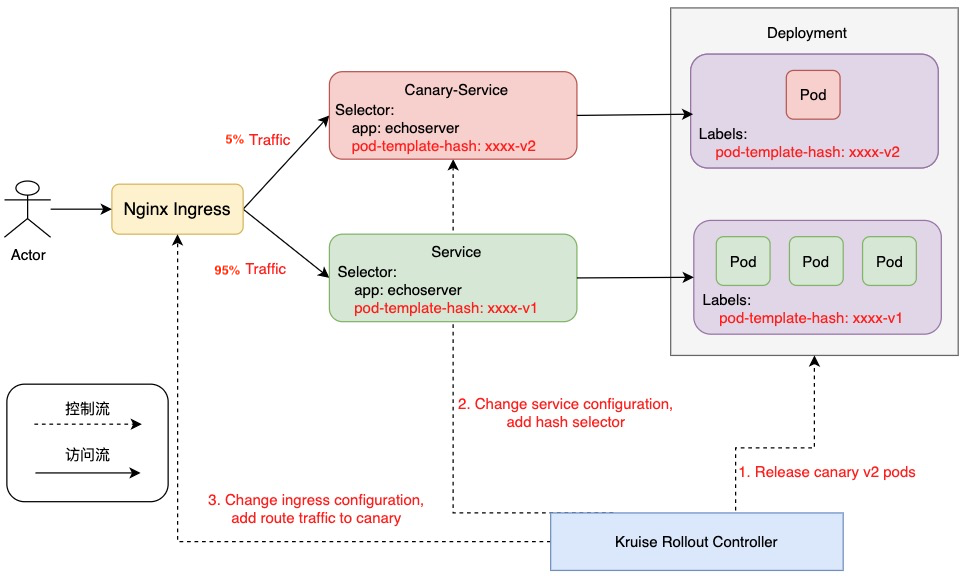
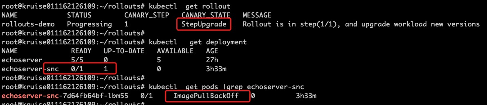

# Basic Usage

This guide will demonstrate various concepts and features of Kruise Rollout by going through **Canary Release, Deployment, Nginx Ingress**.



## Requirements
- Helm installation of Kruise Rollout, Reference [Install Kruise Rollout](../getting_started/installation.md).
- Helm installation of Nginx Ingress Controller, (e.g. **helm upgrade --install ingress-nginx ingress-nginx --repo https://kubernetes.github.io/ingress-nginx --namespace ingress-nginx**)

## 1. Deploy Business Application (Contains Deployment, Service and Ingress)
This is an example of **echoserver application, which contains ingress, service, and deployment crd resources**, as follows:

```yaml
apiVersion: apps/v1
kind: Deployment
metadata:
  name: echoserver
  labels:
    app: echoserver
spec:
  replicas: 5
  selector:
    matchLabels:
      app: echoserver
  template:
    metadata:
      labels:
        app: echoserver
    spec:
      containers:
      - name: echoserver
         # mac m1 should choics image can support arm64,such as image e2eteam/echoserver:2.2-linux-arm64
        image: cilium/echoserver:1.10.2
        imagePullPolicy: IfNotPresent
        ports:
        - containerPort: 8080
        env:
        - name: PORT
          value: '8080'
---
apiVersion: v1
kind: Service
metadata:
  name: echoserver
  labels:
    app: echoserver
spec:
  ports:
  - port: 80
    targetPort: 8080
    protocol: TCP
    name: http
  selector:
    app: echoserver
---
apiVersion: networking.k8s.io/v1
kind: Ingress
metadata:
  name: echoserver
  annotations:
    kubernetes.io/ingress.class: nginx
spec:
  rules:
  - host: echoserver.example.com
    http:
      paths:
      - backend:
          service:
            name: echoserver
            port:
              number: 80
        path: /apis/echo
        pathType: Exact
```
After deployed in k8s cluster, it can be accessed via nginx ingress, as follows:


## 2. Deploy Kruise Rollout CRD
**Kruise Rollout CRD defines the deployment rollout release process, as follows is an example of canary release,
the first step is 20% pods, as well as routing 5% traffics to the new version.**
```yaml
apiVersion: rollouts.kruise.io/v1alpha1
kind: Rollout
metadata:
  name: rollouts-demo
  # The rollout resource needs to be in the same namespace as the corresponding workload(deployment, cloneSet)
  # namespace: xxxx
spec:
  objectRef:
    # rollout of published workloads, currently only supports Deployment, CloneSet
    workloadRef:
      apiVersion: apps/v1
      kind: Deployment
      name: echoserver
  strategy:
    canary:
      # canary published, e.g. 20%, 40%, 60% ...
      steps:
      # routing 5% traffics to the new version
      - weight: 5
      # Manual confirmation of the release of the remaining pods
        pause: {}
      # optional, The first step of released replicas. If not set, the default is to use 'weight', as shown above is 5%.
        replicas: 20%
      trafficRoutings:
        # echoserver service name
      - service: echoserver
        # echoserver ingress name, current only nginx ingress
        ingress:
          name: echoserver
```


## 3. Upgrade echoserver (Version 1.10.2 -> 1.10.3)
Change the image version in deployment from 1.10.2 to 1.10.3, then **kubectl apply -f deployment.yaml** to the k8s cluster, as follows:
```yaml
apiVersion: apps/v1
kind: Deployment
metadata:
  name: echoserver
...
spec:
  ...
  containers:
  - name: echoserver
    # mac m1 can choice image e2eteam/echoserver:2.2-linux-arm
    image: cilium/echoserver:1.10.3
    imagePullPolicy: IfNotPresent
```
**The Kruise Rollout Controller listens to the above behavior and sets deployment paused=true in the webhook, then generates the corresponding canary resources based on the user-defined deployment, service, and ingress configuration.**

As shown in the figure below, replicas(5)*replicas(20%)=1 new versions of Pods are published and 5% of the traffic is routed to the new version.


## 4. Approve Rollout (Release Success)
**The Rollout status shows that the current rollout status is *StepPaused*, which means that the first 20% of Pods are released success and 5% of traffic is routed to the new version.**

After that, developers can use some other methods, such as prometheus metrics business metrics,
to determine that the release meets expectations and then continue the subsequent releases via **[kubectl-kruise](https://github.com/openkruise/kruise-tools) rollout approve rollout/rollouts-demo -n default** and wait deployment release is complete, as follows:


## 5. Release Failure

### Publish Abnormal Version
In the publishing process there are often **cases of publishing failure**, such as the following image pulling failure:
```yaml
apiVersion: apps/v1
kind: Deployment
metadata:
  name: echoserver
...
spec:
  ...
  containers:
  - name: echoserver
    # image not found
    image: cilium/echoserver:failed
    imagePullPolicy: IfNotPresent
```
At this point, the rollout status remains at **StepUpgrade** state, and by checking the deployment and pods status, you can see that it is because the image pull failed.



### a. Rollback To V1 Version
The most common way is Rollback, where you don't need to do anything with the rollout crd,
only just rollback the deployment configuration to the previous version, as follows **rollback the image version in deployment to 1.10.2 and kubectl apply -f to the k8s cluster**.
```yaml
apiVersion: apps/v1
kind: Deployment
metadata:
  name: echoserver
...
spec:
  ...
  containers:
  - name: echoserver
    # m1 should rollback to e2eteam/echoserver:2.2-linux-arm64
    image: cilium/echoserver:1.10.2
    imagePullPolicy: IfNotPresent
```


### b. Continuous Release V3 Version
For some scenarios where you can't rollback, you can continuously release the v3 version. as follows, **change the deployment image address to 1.10.3 and then kubectl apply -f to the k8s cluster**.
Once the publishing is complete, just perform the **Approve Rollout** step.
```yaml
apiVersion: apps/v1
kind: Deployment
metadata:
  name: echoserver
...
spec:
  ...
  containers:
  - name: echoserver
    # m1 can choice image e2eteam/echoserver:2.2-linux-arm
    image: cilium/echoserver:1.10.3
    imagePullPolicy: IfNotPresent
```


